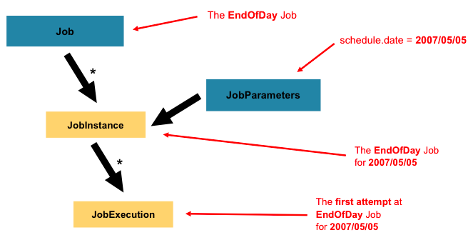

### Spring Batch Domain
---


- Job 과 Step은 일대다 관계를 가지면 하나의 Job은 여러 Step을 실행시킬 수 있다.
- 각 Step은 하나의 ItemReader, 하나의 ItemProcessor 및 하나의 ItemWriter가 있다.
- Job을 실행 시키기 위해서는 JobLanucher가 필요하다.
- JobRepository는 JobLauncher를 통해 Job을 실행하고, Job은 각 Step을 실행하는 과정의 메타데이터 정보를 가지고 있다.

### 간단한 HelloJob 만들기
---

#### HelloJob class
```java
@Configuration
@RequiredArgsConstructor
@Slf4j
public class HelloJobConfiguration {

    private final JobBuilderFactory jobBuilderFactory;
    private final StepBuilderFactory stepBuilderFactory;

    @Bean
    public Job helloJob() {
        return jobBuilderFactory.get("helloJob")
                .start(startStep())
                .next(nextStep1())
                .next(nextStep2())
                .build();

    }


    @Bean
    public Step startStep() {
        return stepBuilderFactory.get("helloStep")
                .tasklet((contribution, chunkContext) -> {
                    log.info("firstStep");
                    return RepeatStatus.FINISHED;
                }).build();
    }

    @Bean
    public Step nextStep1() {
        return stepBuilderFactory.get("nextStep1")
                .tasklet((contribution, chunkContext) -> {
                    log.info("nextStep1");
                    return RepeatStatus.FINISHED;
                }).build();
    }

    @Bean
    public Step nextStep2() {
        return stepBuilderFactory.get("nextStep2")
                .tasklet((contribution, chunkContext) -> {
                    log.info("nextStep2");
                    return RepeatStatus.FINISHED;
                }).build();
    }

}
```
#### 결과


- 먼저 JobLauncher가 helloJob을 실행시킨다.
- job이 실행되면서 실제 작업이 진행될 각 step이 실행된다.
- JobLauncher가 실행되면서 내가 어떤 파라미터 값을 전달할 수 있다는 것을 확인할 수 있다.
    - `o.s.b.c.l.support.SimpleJobLauncher: Job: [SimpleJob: [name=helloJob]] launched with the following parameters: [{}]`


### Job
---

- Job은 Step을 모아놓은 하나의 Container다.
- Job의 구성
  - Job의 이름을 지정한다.
  - Step의 실행 순서를 정의한다.
  - Job을 다시 실행시킬지 말지를 정의한다.
- Job 인터페이스는 SimpleJob을 통해서 기본적으로 구현되어 있다.

```java
@Bean
public Job helloJob() {
    return jobBuilderFactory.get("helloJob")
            .start(startStep())
            .next(nextStep1())
            .next(nextStep2())
            .build();

}
```

#### Job Hierarchy


#### JobInstance

- JobInstance는 ***Job과 JobParmeters가 전달되어 만들어지는 실행가능한 논리적 작업 단위다.***
  - `JobInstance = Job + identifying JobParameters.`
- JobInstance에는 실제 내부 동작을 위한 필드나 메소드가 존재하지 않고, Job의 이름과 JobInstance를 구분하기 위한 Id만 존재한다.
- 새로운 JobInstance를 사용한다는 것은 '처음부터 시작'을 의미하고, 기존 JobInstance를 사용하는 것은 일반적으로 '중단한 곳에서 시작'을 의미
  - 생성 및 기존 JobInstance를 결정 짓는 여부는 JobParameters이다.

#### JobParameters

- JobParameter란 ***job을 실행할 때 전달되는 값***이다.
- JobParameter에는 파라미터로 전달될 키와 값이 존재하고 전달 가능한 타입은 STRING, DATE, LONG, DOUBLE 4개가 있다.
  
#### JobExecution

- JobExecution은 Job과 JobParameters로 만들어진 JobInstance의 실제 실행을 나타내는 객체이다.
- 어떤 JobParametes가 전달되었고 작업 기준이 되는 JobInstance가 무엇인지를 가지고 잇다.
- 작업 실행중 유지/공유되는 정보인 ExecutionContext를 가지고 있다.
- 작업 실해에 관련된 다양한 정보를 가지고 있다.
  - 실행중/종료시 상태, 실패시 발생한 에러, 생성/시작/종로/마지막수정 시간 정보
- 작업이 실패된다면 동일 JobInstance로 새로운 JobExecution이 생길 수 있다.

### Step
---


- Step은 ***실제 배치 처리를 정의하고 제어하는데 필요한 정보***를 가지고 있다.
- Step에서는 개발자가 직접 비지니스로직을 작성하기 때문에 내부 복잡도는 오로지 개발자의 역량에 달려 있다.
- Job은 하나이상의 Step을 가지고 있다.
- JobExecution관 상관관계에 있는 StepExecution이 있다.

#### StepExecution
- StepExecution은 ***Step의 실제 실행에 대한 정보를 나타내는 객체***이며 해당 Step이 실행될 때 생성된다.
- StepExecution에는 JobExecution에 대한 참조와 커밋 및 롤백 횟수, 시작 및 종료 시간과 같은 트랜잭션과 관련된 데이터를 가지고 있다.
  - 실행중/종료시 상태, 시작/종료 시간, ExecutionContext, 읽기/쓰기/필터/커밋/롤백 카운트, 읽기/쓰기/처리의 skip 카운트
- 각 StepExecution에는 개발자가 Batch 실행에서 유지해야하는 데이터를 ExecutionContext가 가지고 있다.

### ExecutionContext
---
- ExecutionContext는 ***각 Job마다, 혹은 각 Step에서 지정된 범위 내에서 데이터를 유지/연결 해주는 역할***을 한다.
  - Job을 실행하면서 필요한 데이터를 지속 가능한 상태로 저장할 수 있다.
  - 키/값의 컬렉션형태로 저장되어 있다.
  - Job ExecutionContext는 해당 Job내에서 언제든지 값을 가지고올 수 있지만, Step ExecutionContext는 해당 Step내에서만 값을 가져올 수 있다.
- 예를 들어 스프링 배치가 진행 도중에 오류가 발생했고, 실패한 시점부터 처리를 다시 시작해야할 때 ExecutionContext에 데이터를 보관하고 있으면 재시작이 용이하다.
- Job과 Step은 ExecutionContext를 각각 가지고 있으며, Execution에 해당 참조를 가지고 있다.

### JobRepository
---

- JobRepository는 배치 실행시 Job의 상태나 데이터 관리를 위한 정보들을 저장해준다.
- JobRepository에 필요한 데이터를 개발자가 직접 CRUD해서 사용할 수 있다.


### JobLauncher
---

- JobLauncher는 Job을 실행시키기위한 인터페이스다.
- JobParameters의 정보를 같이 받아와서 Job을 실행시켜준다.

```java
public interface JobLauncher {

	public JobExecution run(Job job, JobParameters jobParameters) throws JobExecutionAlreadyRunningException,
			JobRestartException, JobInstanceAlreadyCompleteException, JobParametersInvalidException;

}
```

### ItemReader
---

- ItemReader는 ***대량 데이터를 한번에 하나씩 읽을 수 있는 인터페이스***이다.
- 하나의 Item을 리턴하거나 null을 리턴하는데 null일 경우 더이상 읽을 데이터가 없다는 것을 의미하다.
- file, xml, dbms 등 다양한 데이터를 읽을 수 있다.

```java
public interface ItemReader<T> {   T read() throws Exception, UnexpectedInputException, ParseException, NonTransientResourceException;}
```

### ItemWriter
---

- ItemWriter는 ***ItemReader를 통해서 읽어온 Item 들을 저장하기 위한 인터페이스***다.
- file, xml, dbms 등 다양한 저장 매체에 저장할 수 있다.

```java
public interface ItemWriter<T> {   void write(List<? extends T> items) throws Exception;}
```

### ItemProcessor
---

- ItemProcessor는 ***ItemReader를 통해 읽어온 데이터에 비지니스로직을 넣어 가공하는 역할을 하는 인터페이스***다.
- ItemReader를 통해서 읽어온 데이터가 유효하지 않으면 null을 리턴하여 해당 데이터를 ItemWriter가 처리하지 않게 한다.

```java
public interface ItemProcessor<I, O> {   O process(I item) throws Exception;}
```


#### Reference
> - [Spring Batch Domain](https://docs.spring.io/spring-batch/docs/4.2.x/reference/html/domain.html#item-processor)
> - [스프링 배치: Job, JobParameter, JobInstance, JobExecution](https://nankisu.tistory.com/69)
> - [Spring Batch Meta Data](https://gngsn.tistory.com/179)