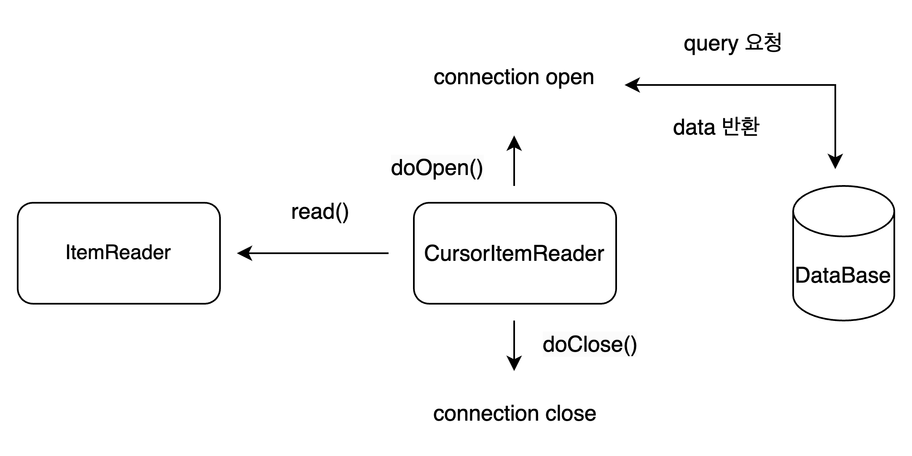
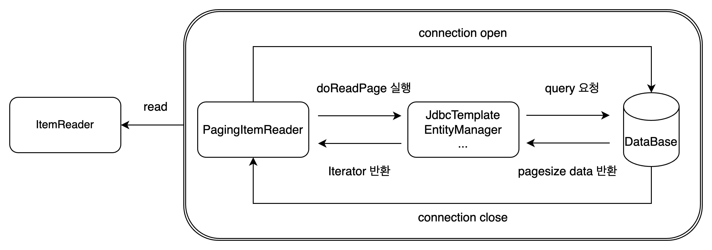

### AbstractItemCountingItemStreamItemReader
---

### CursorItemReader

---

#### 작동원리

1. doOpen() 메서드를 통해서 쿼리 요청 및 데이를 받는다. (Connection Open)
2. `ItemReader`에서 read()메서드를 호출하며 cursor에서 데이터를 가져온다.
    - fetchSize 설정
        - fetchSize 만큼 데이터베이스에서 데이터를 응답받기 때문에 더이상 읽을게 없을경우 fetchSize만큼 데이터베이스에서 데이터를 읽어들인다.
        - 만약 fetchSize를 너무 크게 잡으면 데이터양이 많기 때문에 한번에 많은 데이터가 네트워크를 통해서 들어올 수 있기 때문에 느려질 수 있다. 때문에 적당한 fetchSize를 잡는 것이
          좋다.  
          > https://dataonair.or.kr/db-tech-reference/d-guide/sql/?mod=document&uid=359
    - `JpaCursorItemReader`의 경우 fetchSize 설정이 없다. 많은 양의 데이터를 처리할 때 함부로 사용하지 않는 것이 좋다.
3. cursor를 통해서 더이상 읽을 데이터가 없을 doClose()메서드를 호출한 이후 Step을 종료한다. (Connection Close)

> `AbstractCursorItemReader` 참고하기  
> `JpaCursorItemReader, HibernateCursorItemReader`의 경우에는 `AbstractCursorItemReader`을 상속받지 않는다. 

#### 장점

- Connection을 Step이 실행하는 동안 한번 맺고 끊고, Cursor설정을 하여 이동하는 방식이므로 높은 성능을 보여준다.
- Connection을 Step이 실행하는 동안 한번 맺고 끊기 때문에 데이터 무결성이 유지된다.

#### 단점

- Step이 종료되기 전까지 읽어들인 데이터를 가지고 있기 때문에 메모리 사용량이 높다.
- Thread Safe하지 않기 때문에 멀티 쓰레드 환경에서 사용하기 힘들다.
    - `PagingItemReader`에는 `synchronized` 예약어 존재
- Connection을 Step이 실행하는 동안 한번 맺고 끊기 때문에 Timeout 설정이 필요할 수 있다.

> https://renuevo.github.io/spring/batch/spring-batch-chapter-3/

### PagingItemReader
---

#### 작동 원리

1. `doReadPage` 메서드를 통해서 pageSize만큼 쿼리를 요청한다. (Connection open)
2. pageSize만큼의 데이터를 받고난 뒤에 Iterator를 반환한다.
3. chunkSize 만큼 ItemReader는 read를 한다.
4. 다시 1 ~ 3번 작업을 진행한다.
5. 1 ~ 3번 작업을 진행하면서 데이터가 없다면 더이상 읽어들이지 않는다.
6. 해당 작업을 진행하면서 `AbstractItemCountingItemStreamItemReader`에서 `ExecuteContext`를 통해서 Step의 진행사항을 알 수 있다.

- chunkSize와 pageSize가 동일하지 않는경우
    - chunkSize (10) > pageSize (5)일 경우
        - doReadPage를 두번 실행한다.
    - chunkSize (5) < pageSize (10)일 경우
        - chunkSize를 무시하고 pageSize만큼 read, write를 진행한다.
    - ***pageSize만큼 읽어들인 이후 Step에서 chunkSize만큼 읽어들이기를 원한다면 pageSize와 chunkSize의 값을 같게하는 것이 좋다.***

> `AbstractPagingItemReader` 참고하기

#### 장점

- Connection을 유지하는 방식이 아니기 때문에 Timeout 설정에 크게 주의할 필요 없습니다.
- 메모리 이슈에 대해서 크게 신경쓰지 않아도됩니다.
    - `doReadPage` 메서드에서 `results.clear()`를 호출하여 읽어들인 데이터를 계속해서 삭제하는 것을 확인할 수 있습니다.
- 위와 같은 이유때문에 많은 양의 데이터를 처리할 때 유리합니다.

#### 단점

- Connection을 지속적으로 close하다보니 CursorItemReader 방식보다 느릴 수 있습니다.
- Batch 프로세스 동작동안 데이터 무결성이 유지되지 않을 수 있습니다.
    - 실시간 데이터를 탐색하는 방식이기 대문에 중간에 데이터가 바뀔 수 있습니다.

> https://renuevo.github.io/spring/batch/spring-batch-chapter-3/