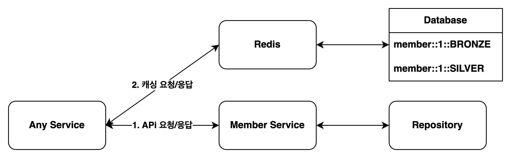
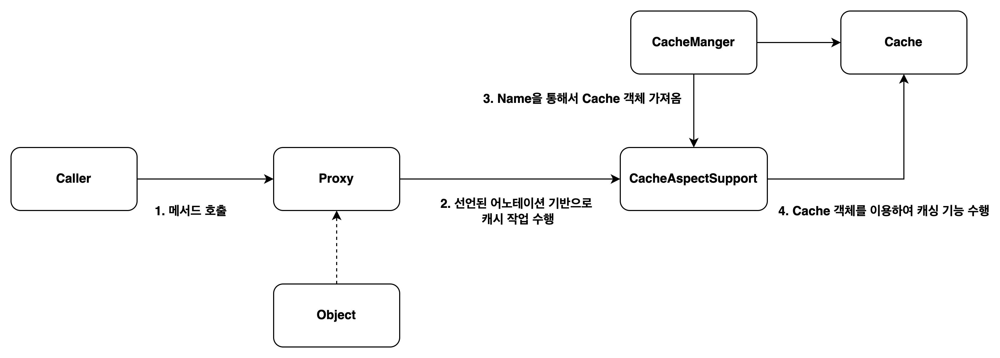

## 1. Spring Cache Abstraction을 사용하면서 발생한 이슈
- 클라이언트에게 응답을 내려줄 때, 빠른 응답을 내려주기위해서 데이터를 캐싱하기 위한 기술인 `Spring Cache Abstraction`과 `Redis`를 활용하고 있다.
- 캐싱을 하면서 고려해야할 점이 상태가 변경되었을 때, 현재 사용되고 있는 캐시의 상태를 변경하거나 삭제해줘야 한다.
  - 그렇지 않으면 상태는 변경이 되었는데 클라이언트는 기존 상태를 응답받는 경우가 발생할 수 있다.
- 이벤트 기반 아키텍처리를 이용하여 상태가 변경되었을 경우 캐시를 삭제하게끔 처리해주고 있는데 여기서 몇가지 이슈가 발새하였다.

### 1.1. 원본 데이터 상태 변경시점에 Cache정보 업데이트 중 발생한 이슈


- 예를들어 하나의 서비스에서 회원에 대한 정보를 캐싱하고 있고, 회원 서비스에서 회원의 정보가 변경이 되면 member id를 전달한다고 가정해보자.
- 회원 한명당 redis의 key가 하나면 좋겠지만, 만약에 두개 이상을 가지고 있다면 어떻게 삭제할까?
- 아래는 캐싱되어 있는 redis key들이다.
    ```
    [cache name]::[member id]::[member level]

    member::1::BRONZE
    member::1::SILVER
    ```

### 1.2. 이슈를 해결하기 위한 몇몇 방법들

1. redis `keys` 명령어를 통해서 삭제
- `keys` 명령어를 사용하게 되면 일치하는 redis key를 찾는 동안 다른 redis 사용자가 block되는 현상 발생되기 때문에 사용하기를 권장하지 않는다.
2. 애플리케이션이 member level에 대한 모든 값을 가지고 있고 이를 조합하여 키를 찾아서 삭제
- 만약 member level에 대한 값이 변경되는 경우는 어떻게?
- 만약 키가 변경이되거나 애플리케이션이 실행될 때 값을 가지고 있을 수 없는 경우라면 어떻게?
<br/>


- 위와같은 문제들 때문에 해당 방법들은 사용하기가 힘들다고 판단하였고 다른 방법을 생각한 것이 바로 키를 관리할 수 있는 키 저장소를 만들면 되지 않을까라는 결론을 내리게 되었다.
- 키를 관리할 수 있는 키 저장소를 만들기 위하여 몇가지 조건을 생각해보았다.
  - 기존 코드의 수정이 거의 이루어 지면 안된다.
  - 모든 캐시키가 관리될 필요는 없다.
  - 원본 데이터 상태 변경 이벤트가 들어올 경우 쉽게 캐시 정보를 업데이트할 수 있어야한다.
  - 키를 관리할 수 있는 키 저장소에 이미 없어진 캐시 키 정보를 가지고 있을 수는 있지만, 현재 가지고 있는 캐시 키 정보는 왠만해서는 가지고 있어야한다.    

## 2. Spring Cache Abstraction
- 서버는 클라이언트의 요청으로 인하여 저장소에 데이터 읽기/쓰기 작업을 한다. 각 서버별로 사용용도가 달라질 수는 있겠지만 ***서버는 주로 쓰기 작업보다 읽기 작업을 더 많이***하게 된다.
- 클라이언트 <-> 서버 <-> 저장소간에 읽기 작업을 진행하면서 응답이 지연되면 이를 해결하기 위하여 캐시를 도입하게 되었다.
- Spring에서는 `Spring Cache Abstraction`을 제공하며 이를 이용하여 캐시를 간단하게 구축할 수 있다.
  - AOP 및 어노테이션 기반으로 캐시 사용이 가능하기 때문에 코드 수정이 적음
  - `Cache` 및 `CacheManager`를 구현하여 다양한 캐시 저장소 사용 가능
  - 캐시 저장소를 변경 시, `Cache` 및 `CacheManager`만 변경면 되기 때문에 캐시가 적용중인 코드에 미치는 영향도가 적음

> [Spring > Understanding the Cache Abstraction](https://docs.spring.io/spring-framework/reference/integration/cache/strategies.html)

### 2.1. Spring Cache Abstraction 구조
- Spring Cache Abstraction은 어노테이션과 AOP를 이용하여 캐시작업을 수행하게 된다.
  - @Cacheable: 캐시가 존재하지 않으면, 저장소에서 데이터를 가져온 이후 캐싱작업을 수행한다. 
  - @CacheEvict: 캐시가 존재할경우 해당 캐시를 삭제한다.
  - @CachePut: 캐시가 존재하지 않으면 캐싱작업을 수행하고, 캐시가 존재한다면 캐시를 업데이트 한다.
- 해당 어노테이션을 기반으로 캐싱 작업을 수행하게끔 해주는 관련 클래스에 대해서도 한번 알아보자.
  - Cache: Cache 인터페이스는 캐싱작업을 수행하기 위한 인터페이스이다.
  - CacheManager: CacheManager는 Cache를 관리하면서 Cache를 찾아주기 위한 역할을 수행한다.
  - CacheAspectSupport: CacheAspectSupport 클래스는 Spring Cache Abstraction 에서 제공하는 어노테이션을 기반으로 동작을 수행해주는 역할을 한다.
    - CacheAspectSupport클래스 덕분에 캐싱 기능을 만들기 위하여 많은 코드를 수정할 필요 없이 어노테이션만 선언해주면 캐싱기능이 수행된다.
- Spring Cache Abstraction 구조를 그림으로 표현하면 아래와 같다.
!
 

## 3. 캐시 키를 관리하기위한 키 저장소 만들기

- 원본 데이터를 수정한 이후에 캐시 정보를 수정하기 위하여 아래의 네가지 조건을 만족해야한다고 했다.
  - 기존 코드의 수정이 거의 이루어 지면 안된다.
  - 모든 캐시키가 관리 대상이 될 필요는 없다. 캐시키에 관리 되어야 할 대상 및 관리 되지 말아야할 대상을 구분 지을 수 있어야한다.
  - 원본 데이터 상태 변경 이벤트가 들어올 경우 쉽게 캐시 정보를 업데이트할 수 있어야한다.
  - 키를 관리할 수 있는 키 저장소에 이미 없어진 캐시 키 정보를 가지고 있을 수는 있지만, 현재 가지고 있는 캐시 키 정보는 왠만해서는 가지고 있어야한다.    
- 위의 조건들을 만족하기 위해서는 캐시가 저장된 이후, 또는 삭제된 이후에 캐시 키를 관리하기 위한 키 저장소에 데이터의 삽입 또는 삭제를 진행하면 된다고 판단하였다.

### 3.1. 작업 수행

- 해당 작업을 수행하기 위하여 새롭게 만들거나 가공해야하는 클래스는 아래와 같다.
  - 스프링이 캐싱 작업을 수행할 수 있도록 하는 설정 클래스
  - RedisCache: Redis에 데이터를 쓰고/읽기 작업을 수행
  - RedisCacheManager: RedisCache를 생성하고, 가져오기위한 작업 수행 
  - 캐시가 저장되고 삭제될 때 핸들링할 수 있는 핸들러 클래스


```java
@Configuration
@EnableCaching
@RequiredArgsConstructor
public class CacheConfig {

    private final KeyStoreRedisCacheHandler keyStoreRedisCacheHandler;


    @Bean
    public CacheManager cacheManager(RedisConnectionFactory connectionFactory){
        RedisCacheWriter redisCacheWriter = RedisCacheWriter.nonLockingRedisCacheWriter(connectionFactory);

        RedisCacheConfiguration defaultCacheConfig = RedisCacheConfiguration.defaultCacheConfig()
                .entryTtl(Duration.ofHours(1))
                .disableCachingNullValues()
                .serializeKeysWith(RedisSerializationContext.SerializationPair.fromSerializer(new StringRedisSerializer()))
                .serializeValuesWith(RedisSerializationContext.SerializationPair.fromSerializer(new GenericJackson2JsonRedisSerializer()));

        return new KeyStoreRedisCacheManager(redisCacheWriter, defaultCacheConfig, keyStoreRedisCacheHandler);
    }

    @Bean
    public KeyGenerator keyGenerator(){
        return new RedisKeyGenerator();
    }

}
```

```java
public class KeyStoreRedisCacheManager extends RedisCacheManager {

    private final KeyStoreRedisCacheHandler keyStoreRedisCacheHandler;
    public KeyStoreRedisCacheManager(RedisCacheWriter cacheWriter, RedisCacheConfiguration defaultCacheConfiguration, KeyStoreRedisCacheHandler keyStoreRedisCacheHandler) {
        super(cacheWriter, defaultCacheConfiguration);
        this.keyStoreRedisCacheHandler = keyStoreRedisCacheHandler;
    }

    //KeyStoreRedisCache 구현체 생성
    @Override
    protected RedisCache createRedisCache(String name, RedisCacheConfiguration cacheConfiguration) {
        return new KeyStoreRedisCache(name, getCacheWriter(), cacheConfiguration, keyStoreRedisCacheHandler);
    }
}
```

```java
public class KeyStoreRedisCache extends RedisCache {

    private final KeyStoreRedisCacheHandler keyStoreRedisCacheHandler;

    protected KeyStoreRedisCache(String name, RedisCacheWriter cacheWriter, RedisCacheConfiguration cacheConfiguration, KeyStoreRedisCacheHandler keyStoreRedisCacheHandler) {
        super(name, cacheWriter, cacheConfiguration);
        this.keyStoreRedisCacheHandler = keyStoreRedisCacheHandler;
    }

    //캐시 저장
    @Override
    public void put(Object key, Object value) {
        super.put(key, value);
        Duration timeToLive = getCacheConfiguration().getTtlFunction().getTimeToLive(key, value);
        keyStoreRedisCacheHandler.put(super.getName(), (String) key, timeToLive);

    }

    //캐시 삭제
    @Override
    public void evict(Object key) {
        super.evict(key);
        keyStoreRedisCacheHandler.evict(super.getName(), (String) key);
    }
}
```

```java
@Component
@RequiredArgsConstructor
public class KeyStoreRedisCacheHandler {

    private final StringRedisTemplate redisTemplate;
    private static final String KEY_SUFFIX = "keys";
    private static final String KEY_DELIMITER = "::";

    //RedisCache가 Redis에 데이터를 저장한 이후 작업 수행
    void put(String cacheKeyPrefix, String cacheKeySuffix, Duration timeToLive){
        //...
    }

    //RedisCache가 Redis에 데이터를 삭제한 이후 작업 수행
    void evict(String cacheKeySuffix, String cacheKeyPrefix){
        //...
    }

    //키 저장소에 저장되어 있는 모든 Redis 데이터 삭제
    public void evictAll(String key){
        //...
    }

    private String getKey(String cacheKeyPrefix, String cacheKeySuffix) {
        String[] arrKeySuffix = cacheKeySuffix.split(KEY_DELIMITER);
        return cacheKeyPrefix + KEY_DELIMITER + arrKeySuffix[0] + KEY_DELIMITER + KEY_SUFFIX;
    }

    private String getValue(String cacheKeyPrefix, String cacheKeySuffix) {
        return cacheKeyPrefix + KEY_DELIMITER + cacheKeySuffix;
    }

}
```


## 3. Cache Key를 관리하기위한 Key 저장소 만들기

### 3.1. Spring Cache Abstraction 캐시 저장 및 삭제 시 핸들링 할 수 있는 핸들러 제작


### 데이터 변경시 Cache를 삭제하며 발생한 이슈

- 기본적으로 캐시를 삭제하면  


### 


`CacheAspectSupport`

> > https://gompangs.tistory.com/entry/Spring-Redis-Template-Transaction
> https://velog.io/@daoh98/redisTemplate.hasKey-null