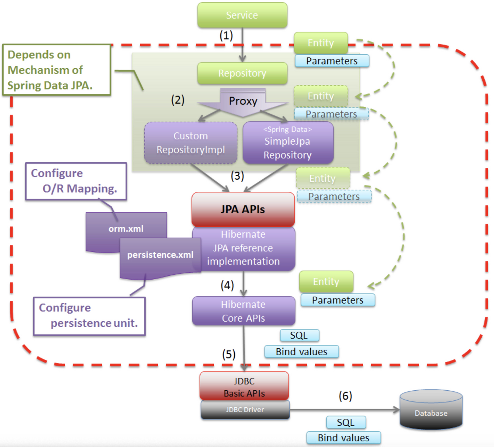

### Spring Data JPA
---

- Spring Data JPA는 스프링 애플리케이션 개발 시 데이터베이스 접근 기술 중에 하나이며 관계형 데이터베이스 엔티티들의 관계를 객체의 관점으로 매핑해주는 기술이다.
- 
- Spring Data JPA는 ORM 기술을 구현하기 위하여 많은 기술들을 추상화하여 사용하고 있다. 그중에서 JDBC -> Hibernamte -> JPA (Java Persistence )


### Spring Data JPA Architecture
---



- 사용자가 Spring Data JPA를 이용하여 데이터베이스에 접근할 때 어떻게 데이터를 불러오는지 단계적으로 한번 알아보자.
  1. 사용자는 Spring Data JPA에서 제공하는 `org.springframework.data.repository.Repository` 인터페이스를 이용하여 데이터 쓰기/읽기를 요청한다.
  2. Repository 인터페이스를 구현한 구현체에서는 `javax.persistence.EntityManager`를 상속받은 `org.hibernate.Session` 인터페이스를 이용하여 JDBC에게 데이터 쓰기/읽기를 요청한다.
  3. `org.hibernate.Session`은 JDBC `java.sql.Connection`을 구성하고 있으며, 이를 이용하여 데이터베이스에 접근하여 사용자가 요청한 데이터 쓰기/읽기 작업을 수행하게 된다.
- Spring Data JPA 기술은 JPA, Hibernate, JDBC 를 추상화하여 만들어진 기술이다.
> 데이터베이스와 Hibernate, EntityManager에 대해서 몰라도 Spring Data JPA를 사용할 수 있지만 문제가 발생하였을 때 이를 해결하기 쉽지 않을 수 있다. 때문에 Spring Data JPA가 사용하는 기술에 대한 이해도를 높이는 것이 중요하다.

### Persistence Context
---

- 영속성 컨텍스트는 엔티티를 저장하는 저장소 역할을 한다. 해당 역할이 필요한 이유는 애플리케이션 <-> 데이터베이스 사이에서 언제 데이터를 읽기/쓰기 작업을 할지 결정하는 프록시 역할을 수행하게 된다.
  - 1차 캐시
  - 쓰기 지연
  - 변경 감지
- 사용자가 생성한 객체를 엔티티 컨텍스트로 저장하기 위해서는 엔티티 매니저가 필요하다. 엔티티 매니저는 엔티티의 생애주기를 관리하며 영속성 컨테스트에서 엔티티를 읽기/수정/삭제할 수 있다.

> Spring Data JPA에서는 Persistence Context가 트랜잭션 단위로 관리된다.

#### Persistence Context에서 관리되는 엔티티 생애주기
- 영속성 컨텍스트에서 관리되고 있는 엔티티는 생애 주기를 가지고 있다.


1. transient (비영속)
   - 사용자가 객체를 생성만 하고 영속성 컨텍스트에 저장하지 않은 상태이다. 즉 영속성 컨텍스트에 한번도 관리된적 없는 상태이다.
   ```java
   //비영속 상태
   Member member = new Member("id", "username");
   ```
<br/>

2. managed or persistent (영속)
   - 영속성 컨텍스트에 관리되어 있는 상태이다. 엔티티 매니저를 통해서 사용자가 생성한 객체를 영속화할 수 있다.
   ```java
   //비영속 상태
   Member member = new Member( "username");
   //영속 상태 : 영속 컨텍스트에 관리
   entityManager.persist(member);
   ```
   - 사용자가 `entityManager.persist`를 직접 호출해야지만 영속화 되는 것은 아니고 사용자가 데이터베이스를 통해서 엔티티를 가져오게 되는 경우에도 해당 엔티티는 영속성 컨텍스트에서 관리된다.
   - 영속성 컨텍스트에서 엔티티가 영속화된다고 하여 데이터베이스에 SQL 쿼리가 바로 요청되는 것은 아니다.
   - 바로 요청해야할 이유가 없는 경우에는 SQL 쿼리를 버퍼에 모아두었다가 요청이 필요한 경우 데이터베이스에 SQL 쿼리를 요청한다. 이러한 기능을 쓰기 지연(transactional write-behind)이라한다. 아래의 경우 쓰기 지연이 발생한다.
   - 영속성 컨텍스트에 관리되는 엔티티의 경우에는 데이터베이스와 동일한 식별자를 가지고있어야한다. 만약 식별자가 없는 경우에는 SQL쿼리를 요청하게된다.
     - 식별자를 `@GeneratedValue(strategy = GenerationType.IDENTITY)`를 이용하여 `entityManager.persist`하는 경우
     - 영속성 컨텍스트에 관리되지 엔티티를 데이터베이스에서 불러오는 경우
<br/>

3. detached (준영속)
   - 영속성 컨텍스트에서 관리되다 더이상 관리하지 않는 상태이다.
   - 영속성 컨텍스트에서 관리만 안되는 것이지 데이터베이스에서 해당 데이터가 삭제되는 것은 아니다.
    ```java
    //비영속 상태
    Member member = new Member( "username");
    //영속 상태 : insert into Member (id, username) values (default, ?)
    entityManager.persist(member);
    //준영속 상태
    entityManager.detach(member);
    //영속 상태: select * from Member where id=?
    Member findMember = entityManager.find(Member.class, 1L);
    assertThat(findMember.getId()).isEqualTo(1L);
    ```
    - 위의 코드를 통해서 확인할 수 있듯이 영속 상태를 준영속 상태로 만든 이후 해당 데이터를 읽도록 요청하게되면 DB에 데이터가 삭제되지는 않았다는 것을 확인할 수 있다.
    - 다만 영속성 컨텍스트에 관리 되지 않는 준영속 상태를 다시 영속 상태로 만들었을 때 SQL 쿼리를 요청했다는 것을 확인할 수 있는데 이말은 영속성 컨텍스트에서 더이상 관리되지 않는다는 것을 알 수 있다.
      - 일반적으로 영속성 컨텍스트에 관리되는 엔티티를 읽어들일 경우 SQL쿼리를 요청하여 엔티티를 전달하는 것이 아닌 영속성 컨텍스트에서 해당 엔티티를 가져오게된다. 이를 1차 캐시라 한다.
<br/>

4. removed (삭제)
   - 영속성 컨텍스트에 관리되고 있는 엔티티가 데이터베이스에서 제거되도록 예약되어 있는 상태를 의미한다.
   - 데이터베이스에서 제거되도록 예약은 되어 있지만 영속성 컨택스트에서는 관리되고 있는 상태이다.
    ```java
    //비영속 상태
    Member member = new Member( "username");
    //영속 상태 : insert into Member (id, username) values (default, ?)
    entityManager.persist(member);
    //삭제 상태
    entityManager.remove(member);
    //영속 상태
    Member findMember = entityManager.find(Member.class, 1L);
    assertThat(findMember.getId()).isEqualTo(1L);
    ```
    - 삭제 -> 영속 상태로 되는 경우에 SQL 쿼리를 요청하지 않으며 테스트 코드도 정상 동작한 것을 알 수 있다.
    - 이는 `entityManager.remove`를 호출해도 해당 엔티티는 영속성 컨텍스트에서 관리되고 있음을 의미한다.
    - 만약 해당 엔티티를 영속성 컨텍스트에서 관리되지 않도록 하고싶다면 `flush`를 호출하면 된다.
        ```java
        //삭제 상태
        entityManager.remove(member);
        entityManager.flush();
        //영속 상태
        Member findMember = entityManager.find(Member.class, 1L);
        assertThat(findMember).isNull();
        ```