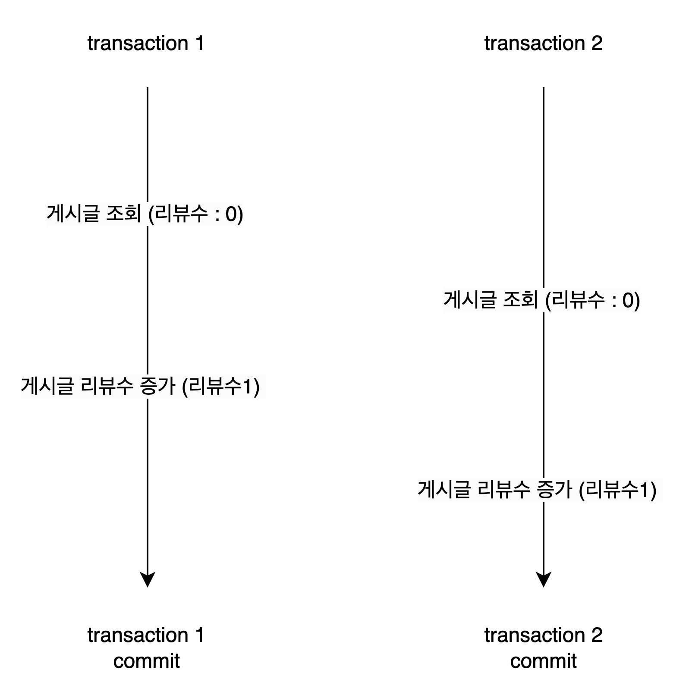

### 동시성 이슈
- 주로 동시성 이슈라는 말은 하나의 데이터에 여러 스레드가 접근하여 읽기/쓰기 작업을 진행할 때 나타나는 문제이다. 코드를 통해서 한번 확인해보자.
    ```java
    private static int count = 0;

    public static void main(String[] args) throws ExecutionException, InterruptedException {
        int threadCount = 5;
        ExecutorService executorService = Executors.newFixedThreadPool(threadCount);

        ArrayList<Future<Integer>> futures = new ArrayList<>();
        for (int i = 0; i < threadCount; i++) {
            Future<Integer> future = executorService.submit(() -> {
                count = count + 1;
                return count;
            });
            futures.add(future);

        }

        for (Future<Integer> future : futures) {
            future.get();
        }

        System.out.println("count = " + count);
        executorService.shutdown();
    }
    ``` 
  - 위의 코드는 스레드를 5개 생성하여 count 변수를 1씩 더하는 예제이다.
  - 내가 원하는 결과는 count를 1씩 더해가며 결과적으로 5라는 결과값이 나오는 것을 기대하지만 지속적으로 실행하다보면 count가 5가 나오지 않는 경우가 있다.
  - 코드를 통해서 확인할 수 있듯이 여러 스레드가 동시에 하나에 데이터를 접근하게 될 경우 사용자가 원하지 않은 결과 값이 나오는 것을 확인할 수 있다. 해당 문제가 우리가 흔히 이야기하는 동시성 이슈라고 이야기한다.
- 동시성 이슈가 발생했을 경우 해당 원인을 찾기가 힘들며 동시성 이슈를 해결할 수 있는 Lock에 대한 이해도가 없으면 문제를 해결하기도 힘들다.
> java에서는 동시성 이슈를 해결하기위한 예약어나 API가 존재한다. 해당 내용을 같이확인해보면 

### 웹프로젝트에서 Spring Data JPA를 사용하며 발생할 수 있는 동시성 이슈

- 웹프로젝트의 경우 멀티스레드 환경에서 돌아가며 원격 저장소에 있는 하나의 데이터를 대상으로 동시에 접근하여 데이터 읽기/쓰기를 진행할 수 있다.
- 여러 스레드가 하나의 데이터를 접근할 수 있기 때문에 이는 곳 동시성 이슈를 야기할 수 있다.


#### 1. 비관적 락을 이용한 동시 INSERT 방지
- 한명의 사용자가 테이블에 하나의 레코드를 가져야하는 경우는 무수히 많다.
- 사용자가 개발자가 생성한 주문번호를 통해서 주문을 한다고 가정해보자.
- 주문을 하는 사용자가 성질이 급하여 주문을 연타로 클릭한다고 생각했었을때, 동일 주문 번호로 주문테이블에 삽입 될 수 있는 문제가 있다. 아래의 코드를 통해서 확인해보자. 
    ```java
    @RestController
    @RequiredArgsConstructor
    public class OrderController {
        //...

        @Data
        private static class OrderRequest{
            private String orderNum;
        }

        @PostMapping("/orders")
        public void order(@RequestBody OrderRequest orderRequest){
            orderService.order(orderRequest.getOrderNum());
        }

        @PostMapping("/orders/multi-thread")
        public void orderMultiThread(@RequestBody OrderRequest orderRequest){
            ExecutorService executorService = Executors.newFixedThreadPool(10);
            RestTemplate restTemplate = restTemplateBuilder.build();
            for (int i = 0; i < 10; i++) {
                executorService.execute(() -> {
                    restTemplate.postForObject(HOST + "/orders", orderRequest, Void.class);
                });
            }

            executorService.shutdown();
        }
    }
    ```
    - `/orders`는 주문 번호를 통해서 주문을 진행 시키며, `/orders/multi-thread`는 한명의 사용자가 주문 버튼을 연속해서 10번 클릭하여 `/orders`가 동시에 호출 되었을 때를 가정한다.
    - `/orders/multi-thread`를 요청하게 되면 동일한 주문번호를 가진 10개의 레코드가 데이터베이스에 저장된다.
        ```json
        [
            {
                "id": 1,
                "orderNum": "1111"
            },
            {
                "id": 2,
                "orderNum": "1111"
            },
            {
                "id": 3,
                "orderNum": "1111"
            },
            //....
        ]
        ```
    - 해당 문제를 해결하기 위한 가장 간단한 방법은 데이터베이스의 제약조건에서 중복된 값을 가진 레코드가 삽입되지 않도록 하는 기본키와 유니크키를 활용해볼 수 있다.
    - 주문 테이블에 주문 번호 컬럼에 유니크키를 설정한 이후에 `/orders/multi-thread`를 호출하면 어떤일이 발생할까?
        ```java
        //...
        public class OrderJpaEntity {

            @Id
            @GeneratedValue(strategy = GenerationType.IDENTITY)
            private long id;
            @Column(name = "order_num", unique = true)
            private String orderNum;
        }
        //...
        ```
    - `org.h2.jdbc.JdbcSQLIntegrityConstraintViolationException`예외가 발생한다. 즉 h2 데이터베이스에서 무결성 제약 조건에 위배되어 해당 에러가 발생하며 하나의 레코드만 존재하는 것을 확인할 수 있다.
    ```json
    [
        {
            "id": 1,
            "orderNum": "1111"
        }
    ]    
    ```
- 주문번호가 동시에 삽입될 수 있다는 것을 가정하고 데이터베이스의 제약 조건 즉 Lock을 거는 방법을 비관적 락이라고 부른다.
- 비관적 락을 통해서 동시성을 제어할 수 있다는 의미는 여러 트랜잭션의 요청에도 하나의 트랜잭션만이 읽기/쓰기가 가능하다는 의미이다. 하지만 이러한 비관적 락에는 치명적인 단점이 있는데 많은 트래픽이 몰리기 시작하면 성능이 저하되는 문제가 있다. 왜냐하면 아무리 많은 트랜잭션의 요청이 들어와도 하나의 트랜잭션만 처리할 수 있기 때문에 다른 트랜잭션에서 타임아웃이 발생할 가능성이 있다.
- 해당 문제를 해결하기 위해서는 큐를 이용하여 대기열 시스템을 만들고 실제 데이터에 쓰는 작업을 지연시켜 해결할 수 있는 방법이 있다.


#### 2. 동시에 많은 사용자가 동일한 데이터에 UPDATE하게 될 경우에는 어떻게 할것인가?

- 게시글에 리뷰를 달았을때 게시글의 리뷰수를 증가시키는 요구사항이 들어왔다고 가정을 하고 해당 비지니스 로직을 작성한다면 아래와 그림과 같은 흐름을 가지게 될 것이다.


- 한명의 사용자가 리뷰수를 증가시키는 것은 아무런 문제가 없겠지만 다수의 사용자가 리뷰를 작성하고 증가시키게 되면 어떤 문제가 발생할까?
```java
@RestController
@RequiredArgsConstructor
public class BoardController {
    //...
    @PostMapping("/boards/{id}/reviews/multi-thread")
    public void writeReviewMultiThread(@PathVariable long id){
        ExecutorService executorService = Executors.newFixedThreadPool(10);
        RestTemplate restTemplate = restTemplateBuilder.build();
        for (int i = 0; i < 10; i++) {
            executorService.execute(() -> {
                restTemplate.postForObject("http://localhost:8080/boards/{id}/reviews", null,
                        Void.class, id);
            });
        }

        executorService.shutdown();
    }
}
```
- `/boards/{id}/reviews/multi-thread`는 10명의 사용자가 동시에 리뷰를 작성하게 될 경우를 가정하여 만든 API이다. 해당 API를 호출하게 될 경우 리뷰수가 10이 나오기를 예상하지만, 기대한 값과 달리 다른 값이 계속해서 나온다.
- 해당 문제가 발생한 이유는 하나의 트랜잭션이 종료되지 않은 상태에서 동시에 여러 사용자가 게시판의 리뷰수에 접근하여 발생한 동시성 이슈이다. 



- 위의 그림을 보면 transaction1과 transaction2가 서로 커밋이 완료되기전에 게시글을 조회하였고 이때 게시글의 리뷰수는 0이다.
- 이후 transaction1과 transaction2이 리뷰를 작성한 이후 0인 리뷰수를 1씩 증가하는 것이기 때문에 2가 될것이라고 예상하지만 1이 발생하는 것이다.
- 그렇다면 우리는 어떻게 해당 문제를 해결할 수 있을까? 가장 먼저 떠오르는 방법은 하나의 레코드에 접근할 때 Lock을 걸어서 해결하는 방법이 있다. 가장 간단한 방법은 transaction1과 transaction2가 동시에 접근한다고 하여도 transaction1이 작업을 완료한 이후에 transaction2가 작업을 시작하게끔 하는 것이다.


- Spring Data JPA와 H2 데이터베이스를 이용하여 게시판에 조회수를 증가시키는 예제를 통해서 한번 확인해보자.
    ```java
    @RestController
    @RequiredArgsConstructor
    public class BoardController {

        @PutMapping("/boards/{id}")
        public void increaseViewHit(@PathVariable long id){
            boardService.increaseViewHit(id);
        }

        @PutMapping("/boards/{id}/multi-thread")
        public void increaseViewHitConcurrency(@PathVariable long id){
            ExecutorService executorService = Executors.newFixedThreadPool(10);
            RestTemplate restTemplate = restTemplateBuilder.build();
            for (int i = 0; i < 10; i++) {
                executorService.execute(() -> {
                    restTemplate.put(host + "/boards/{id}", null, id);
                });
            }

            executorService.shutdown();
        }
    }
    ```
    - `/boards/{id}`는 게시판의 조회수를 증가시키며, `/boards/{id}/multi-thread`는 10명의 사용자가 거의 동시에 `/boards/{id}`에 접근하는 경우이다. 동시에 10명의 사용자가 접근하기때문에 조회수가 10이라는 결과값이 나오기를 기대한다. 하지만 우리가 기대한것과 달리 전혀 다른 결과를 응답해준다.
    ```json
    // curl -XGET http://localhost:8080/boards/1 호출 
    {
        "id": 1,
        "viewHit": 1
    }
    ```
    - 10개의 스레드를 동시에 호출하여 조회수를 증가시켜달라고 하였지만 우리가 원하는 결과값은 나오지 않은 것을 확인할 수 있다.
  - 


> https://parkmuhyeun.github.io/woowacourse/2023-10-04-concurrency/
> [3.8. Version attributes](https://docs.jboss.org/hibernate/orm/6.4/introduction/html_single/Hibernate_Introduction.html#version-attributes)
> [7.15. Optimistic and pessimistic locking](https://docs.jboss.org/hibernate/orm/6.4/introduction/html_single/Hibernate_Introduction.html#optimistic-and-pessimistic-locking)
