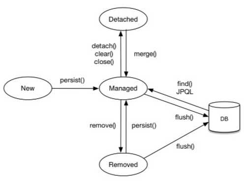

### 영속성 컨텍스트란?
---
> 영속성 컨텐스트란 ***엔티티를 영구 저장하는 환경***이라는 뜻이다. 애플리케이션과 데이터베이스 사이에서 객체를 보관하는 가상의 데이터베이스 같은 역할을 한다. 엔티티 매니저를 통해 엔티티를 저장하거나 조회하면 ***엔티티 매니저는 영속성 컨텍스트에 엔티티를 보관하고 관리***한다.

### 영속성 컨텍스트의 상태
---

- 영속성 컨텍스트에는 총 네가지 상태가 존재한다.

#### 1. transient (비영속)

- 영속성 컨텍스트와 전혀 관계가 없는 상태이다.
- 인스턴스의 생성 했지만 식별자(@id)가 없다.
```java
    Member member = new Member();
```

#### 2. managed / persistent (영속)
- 영속성 컨텍스트에서 관리되는 상태이다.
- ORM 기능을 활용 가능한 상태이다.
- 영속 상태 만들기
    - `entityManager.persist(entity);`
    - `entityManager.find(Entity.class, id)`
```java
        //비영속 상태
        Member member = Member.createMember("username");
        //영속 상태 : 영속 컨텍스트에 관리
        entityManager.persist(member);
        entityManager.flush();

        //영속 상태에서의 변경 감지 작동 확인
        member.setUsername("username2");
        assertTrue(((Session) entityManager).isDirty());
        entityManager.flush();

        //동일성 보장 확인
        Member findMember = entityManager.find(Member.class, member.getId());
        assertEquals(member, findMember);

        transaction.commit(); 
```
#### 3. detach (준영속)
- 영속성 컨텍스트에서 관리되다 더이상 관리하지 않는 상태이다.
- 한번 관리되었기 때문에 식별자(@id) 값을 가지고 있다.
- 준영속 상태 만들기
	- `entityManager.detach(entity);`
	- `entityManager.close();`
	- `entityManager.clear();`
```java
        //비영속 상태
        Member member = Member.createMember("username");

        //영속 상태 : 영속 컨텍스트에 관리
        entityManager.persist(member);
        entityManager.flush();

        //준영속
        entityManager.detach(member);

        //변경 감지 작동 안하는 것 확인
        member.setUsername("username2");
        assertFalse(((Session) entityManager).isDirty());
        entityManager.flush();

        //동일성 보장 안되는 것 확인
        Member findMember = entityManager.find(Member.class, member.getId());
        assertNotEquals(member, findMember);

        transaction.commit(); 
```
#### 4. remove (삭제)
- 물리적인 데이터베이스에서 삭제가 예약된 상태이다.
- 식별자가 존재하며 영속성 컨텍스트에서 관리가 된다.
- 삭제 상태 만들기
	- `entityManager.persist(member);`
```java
        //비영속 상태
        Member member = Member.createMember("username");
        //영속 상태 : 영속 컨텍스트에 관리
        entityManager.persist(member);
        entityManager.flush();

        //삭제 확인
        entityManager.remove(member);
        entityManager.flush();

        //데이터 베이스 값 없는 것 확인
        Member findMember = entityManager.find(Member.class, member.getId());
        assertNull(findMember);

        transaction.commit();    
```

### 엔티티 매니저 생명 주기
---



### 영속성 컨텍스트 특징
---

#### 1. 1차 캐시
- 영속성 컨텍스트에서 관리되고 있는 상태의 엔티티들을 조회시, ***DB를 통해서 데이터를 조회하는 것이 아닌 영속성 컨택스트에서 관리되고 있는 엔티티를 조회***한다.
-  이를 "1차캐시에서 조회한다"라고 한다.
- 생각해보면 이미 영속성 컨텍스트 내에서 관리되고 있는 엔티티의 상태가 변경되었다고 해도 엔티티 변경 -> DB 반영 순 이기 때문에 조회시 굳이 DB를 접근하여 조회할 필요성이 없다.

  ```java
  Member member = Member.createMember("id", "username");
  entityManager.persist(member);

  //select 문 실행 안하고 1차캐시에서 조회한다.
  Member findMember = entityManager.find(Member.class, "id");

  //영속성 컨텍스트에서 관리되고 있는 엔티티가 아니기 때문에
  //select 문 실행하고 DB에서 데이터를 조회한다.
  Member findMember2 = entityManager.find(Member.class, "id2");
  ```

#### 2. 동일성 보장
- 엔티티를 영속성 컨텍스트에 관리함으로, 해당 ***엔티티를 조회하면 1차 캐시 내에 있는 엔티티를 가져오기 때문에 동일성을 보장***해준다.
```java

Member member = Member.createMember("id", "username");

entityManager.persist(member);
entityManager.flush();

//동일성 보장
Member sameMember1 = entityManager.find(Member.class, 1l);
Member sameMember2 = entityManager.find(Member.class, 1l);
```


#### 3. 트랜잭션을 지원하는 쓰기 지연
- ***영속성 컨텍스트에 관리되는 엔티티는 insert나 update 되는 쿼리를 트랜잭션이 커밋되는 순간 한번에 DB에 전송한다.***
- DB 커넥션 시간을 줄일 수 있으며, 한 트랜잭션이 테이블에 접근하는 시간을 줄일 수 있다.
- 영속성 컨텍스트는 트랜잭션 내에서 가상의 데이터베이스 역할을 하기 때문에 가능한 특징이다.
  ```java
  transaction.begin();

  Member member1 = Member.createMember("id1", "username1");
  Member member2 = Member.createMember("id2", "username2");

  //영속 컨텍스트에 관리된 상태이며 데이터베이스에 INSERT하지 않는다.
  entityManager.persist(member1);
  entityManager.persist(member2);

  System.out.println("======================쓰기 지연======================");

  transaction.commit();
  ```
- ***주의할점은 식별자 생성전략을 `IDENTITY` 사용하면 쓰기 지연을 사용할 수 없다.***
  - 엔티티가 영속화가 되기 위해서는 식별자가 필요한데 IDENTITY 전략은 DB에 실제로 저장을 해야지 식별자를 구할 수 있기 때문이다.


#### 4. 변경 감지
- ORM은 객체지향 관점에서 데이터 베이스를 다루는 기술이다.
- 그러므로 객체의 필드 변경이 곧 SQL의 업데이트문과 같다.
  - EntityManager에는 update문을 위한 메소드가 없다.
  - `entityManger.merge(entity)` 주의
  ```java
  Member member = Member.createMember("username");
  entityManager.persist(member);
  entityManager.flush();
  entityManager.clear();
          
  //변경 감지
  Member findMember = entityManager.find(Member.class, 1l);
  findMember.setUsername("username2");
          
  transaction.commit();
  ```
- 순수 SQL문으로 만든다면 엄청나게 많은 쿼리를 작성하거나 쿼리를 문자열로 조합해서 사용해야하는데 이러한 번거러움을 한방에 없애준다.


> **Reference**
> - [Hibernate-Reference](https://docs.jboss.org/hibernate/orm/5.6/userguide/html_single/Hibernate_User_Guide.html#pc)
> - [JPA 영속성 컨텍스트란?](https://velog.io/@neptunes032/JPA-%EC%98%81%EC%86%8D%EC%84%B1-%EC%BB%A8%ED%85%8D%EC%8A%A4%ED%8A%B8%EB%9E%80)
> - [JPA 영속성 컨텍스트의 1차캐시 & 쓰기지연은 정말 동작하는가?](https://jobc.tistory.com/209)

