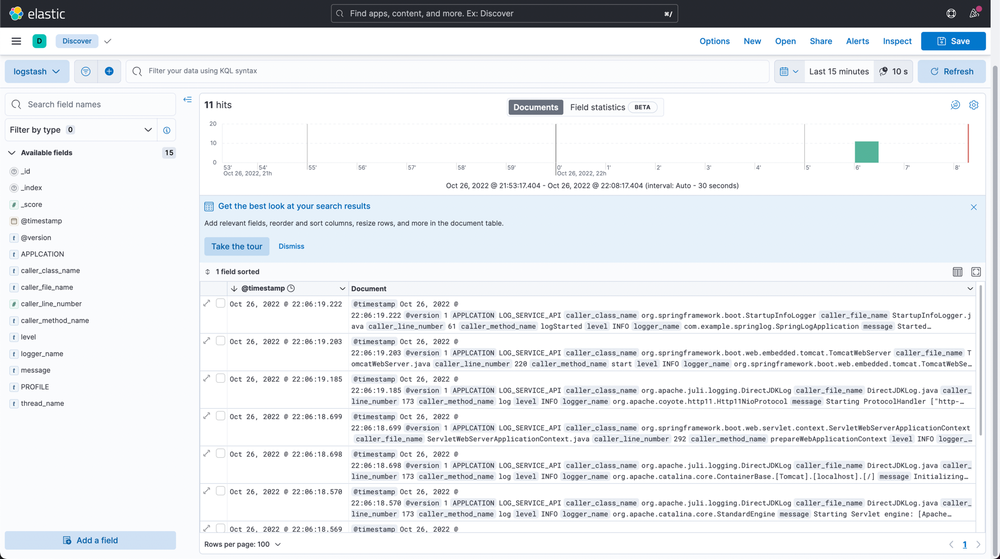

### 로그 레벨
---
심각도 : ERROR > WARN > INFO > DEBUG > TRACE

- ERROR : 예상하지 못한 심각한 문제가 발생한 경우, 즉시 조취를 취해야하는 경우
- WARN : 로직상 유효성 확인, 예상 가능한 문제로 인한 예외 처리, 당장 서비스를 운영하는데는 문제가 없지만 주의해야하는 경우
- INFO : 운영에 참고할만한 사항, 중요한 비지니스 프로세스가 완료됨
- DEBUG : 개발 단계에서 사용하며, SQL 로깅이 가능
- TRACE : 모든 레벨에 대한 로깅이 추적되므로 개발 단계에서 사용


### 스프링 부트에서 환경별 로깅 설정하기
---
- 실제 프로젝트를 진행하다보면 각 환경별로 어떻게 로깅을 남겨야 할지를 고민할 때가 있다.
    - 로컬환경에서는 굳이 파일로 확인할 필요가 없으니 콘솔에 출력할지 고민
    - 개발환경에서는 다른 개발자도 참가할 수 있는데 파일에 로그 기록을 남길지 고민
    - 실제 운영환경에서는 로그파일 때문에 디스크 풀이 일어나서 서버가 다운되면 안되니 어떤 정책으로 삭제해줄지 고민
    - 등등..
#### 스프링 환경별에 따른 application-${profile}.yml 설정
```text
└── resources
    ├── application.yml
    ├── application-local.yml
    ├── application-dev.yml
    └── application-prod.yml
```
- 스프링 프로젝트를 실행하기전 profile property를 셋팅하면 각 환경에 맞는 application.yml 파일을 셋팅해준다.
    ```bash
    java -Dspring.profiles.active=${profile 명} -jar ./build/libs/${jar 파일명}.jar
    ```
#### logback.xml 파일을 작성하는 이유
- application.yml 파일을 통해서 log에 필요한 속성을 셋팅은 할 수 있지만 실제 프로덕트 환경에서는 사용하기에는 세부적인 설정을 하기 어렵기 때문에 logback.xml을 작성한다.

### local 환경에 맞는 logback.xml 작성하기
---

- local 환경에서는 콘솔 출력을 위한 셋팅을 한다.
- `src/main/resources/logback-spring.xml` 이 스프링 logback.xml 을 작성하는 기본 경로 및 파일 명이다. 일단 로컬환경에서는 logback 파일명을 변경해서 사용을 해보자.
#### 1. application-local.yml
- logback-spring-local.xml 파일에 작성된 로깅 설정 사용하기
```yml
logging:
    config: classpath:logback-spring-local.xml
```

#### 2. logback-properties.xml에 로그 관련 프로퍼티 값 셋팅하기
```xml
<?xml version="1.0" encoding="UTF-8"?>

<included>
    <!-- 로그 패턴에 색상 적용 %clr(pattern){color} -->
    <conversionRule conversionWord="clr" converterClass="org.springframework.boot.logging.logback.ColorConverter" />

    <property name="CONSOLE_LOG_PATTERN" value="${CONSOLE_LOG_PATTERN:-%clr(%d{${LOG_DATEFORMAT_PATTERN:-yyyy-MM-dd'T'HH:mm:ss.SSSXXX}}){faint} %clr(${LOG_LEVEL_PATTERN:-%5p}) %clr(${PID:- }){magenta} %clr(---){faint} %clr([%15.15t]){faint} %clr(%-40.40logger{39}){cyan} %clr(:){faint} %m%n${LOG_EXCEPTION_CONVERSION_WORD:-%wEx}}"/>
</included>
```

#### 3. logback-spring-local.xml 파일 적성
```xml
<?xml version="1.0" encoding="UTF-8" ?>
<configuration>
    <!-- logback-properties.xml 파일 포함-->
    <include resource="logback-properties.xml"></include>

    <!-- 콘솔(STDOUT) -->
    <appender name="STDOUT" class="ch.qos.logback.core.ConsoleAppender">
        <layout class="ch.qos.logback.classic.PatternLayout">
            <Pattern>${CONSOLE_LOG_PATTERN}</Pattern>
        </layout>
    </appender>
    <!-- root 로깅 레벨 설정-->
    <root level="INFO">
        <appender-ref ref="STDOUT"/>
    </root>
</configuration>
```

### dev 환경에 맞는 logback.xml 작성하기
---

- dev 환경에서는 콘솔과 파일을 통해서 로그를 출력한다.
- 파일 로그
    1. 파일 로그는 info, error 레벨의 파일로그를 각각 남긴다.
    2. info level의 파일 로그는 info, warn, error 로그까지 남긴다.
    3. error level의 파일 로그는 error 로그만 남긴다.

#### 1. application-dev.yml
- logback-spring-dev.xml 파일에 작성된 로깅 설정 사용하기
```yml
logging:
    config: classpath:logback-spring-dev.xml
```

#### 2. logback-properties.xml에 로그 관련 프로퍼티 값 셋팅하기
```xml
<?xml version="1.0" encoding="UTF-8"?>

<included>
    <!-- 로그 패턴에 색상 적용 %clr(pattern){color} -->
    <conversionRule conversionWord="clr" converterClass="org.springframework.boot.logging.logback.ColorConverter" />

    <property name="CONSOLE_LOG_PATTERN" value="${CONSOLE_LOG_PATTERN:-%clr(%d{${LOG_DATEFORMAT_PATTERN:-yyyy-MM-dd'T'HH:mm:ss.SSSXXX}}){faint} %clr(${LOG_LEVEL_PATTERN:-%5p}) %clr(${PID:- }){magenta} %clr(---){faint} %clr([%15.15t]){faint} %clr(%-40.40logger{39}){cyan} %clr(:){faint} %m%n${LOG_EXCEPTION_CONVERSION_WORD:-%wEx}}"/>
    <property name="FILE_LOG_PATTERN" value="${FILE_LOG_PATTERN:-%d{${LOG_DATEFORMAT_PATTERN:-yyyy-MM-dd'T'HH:mm:ss.SSSXXX}} ${LOG_LEVEL_PATTERN:-%5p} ${PID:- } --- [%t] %-40.40logger{39} : %m%n${LOG_EXCEPTION_CONVERSION_WORD:-%wEx}}"/>

</included>
```

#### 3. logback-spring-dev.xml 파일 적성
```xml
<?xml version="1.0" encoding="UTF-8" ?>
<configuration>

    <!-- logback-properties.xml 파일 포함-->
    <include resource="logback-properties.xml"></include>
    <!-- 로그 파일 입력할 절대 경로 -->
    <property name="LOGS_ABSOLUTE_PATH" value="./logs"></property>
    <!-- 콘솔(STDOUT) -->
    <appender name="STDOUT" class="ch.qos.logback.core.ConsoleAppender">
        <layout class="ch.qos.logback.classic.PatternLayout">
            <Pattern>${CONSOLE_LOG_PATTERN}</Pattern>
        </layout>
    </appender>


    <!-- 파일(FILE) -->
    <appender name="FILE" class="ch.qos.logback.core.rolling.RollingFileAppender">
        <!-- log 기록할 파일 위치 설정 -->
        <file>${LOGS_ABSOLUTE_PATH}/info.log</file>
        <!--     log 기록 타입 인코딩 -->
        <encoder>
            <pattern>${FILE_LOG_PATTERN}</pattern>
        </encoder>
        <rollingPolicy class="ch.qos.logback.core.rolling.SizeAndTimeBasedRollingPolicy">
            <!-- daily rollover -->
            <fileNamePattern>${LOGS_ABSOLUTE_PATH}/info.%d{yyyy-MM-dd}.%i.log</fileNamePattern>
            <!-- keep 30 days' worth of history capped at 3GB total size -->
            <maxHistory>30</maxHistory>
            <maxFileSize>100MB</maxFileSize>
            <totalSizeCap>20GB</totalSizeCap>
        </rollingPolicy>
    </appender>

    <!-- 파일(FILE) -->
    <appender name="FILE_ERROR" class="ch.qos.logback.core.rolling.RollingFileAppender">
        <!-- log 기록할 파일 위치 설정 -->
        <file>${LOGS_ABSOLUTE_PATH}/error.log</file>
        <!-- 로깅 레벺 필터 -->
        <filter class="ch.qos.logback.classic.filter.LevelFilter">
            <level>ERROR</level>
            <onMatch>ACCEPT</onMatch>
            <onMismatch>DENY</onMismatch>
        </filter>
        <!--     log 기록 타입 인코딩 -->
        <encoder>
            <pattern>${FILE_LOG_PATTERN}</pattern>
        </encoder>
        <rollingPolicy class="ch.qos.logback.core.rolling.SizeAndTimeBasedRollingPolicy">
            <!-- daily rollover -->
            <fileNamePattern>${LOGS_ABSOLUTE_PATH}/error.%d{yyyy-MM-dd}.%i.log</fileNamePattern>
            <!-- keep 30 days' worth of history capped at 3GB total size -->
            <maxHistory>30</maxHistory>
            <maxFileSize>100MB</maxFileSize>
            <totalSizeCap>20GB</totalSizeCap>
        </rollingPolicy>
    </appender>

    <root level="INFO">
        <appender-ref ref="STDOUT"/>
        <appender-ref ref="FILE"/>
        <appender-ref ref="FILE_ERROR"/>
    </root>
</configuration>
```


### prod 환경에 맞는 logback.xml 작성하기
- prod 환경에서는 elk 스택을 활용하여 로그 기록을 남긴다.
  - logstash (로그 수집) -> elasticsearch (로그 저장) -> kibana (시각화)
  - docker 환경에서 작업 진행, 실제 환경에서 elasticsearch는 docker로 활용안할 확률이 높다.
- 확인을 위하여 콘솔에 로그 스태시에 전송할 로그와 동일한 로그를 출력한다.

#### 1. docker 폴더 구조
```text
docker
├── docker-compose.yml
├── elasticsearch
│   ├── Dockerfile
│   ├── config  
│   │   └── elasticsearch.yml
│   └── data
├── kibana
│   ├── Dockerfile
│   └── config
│       └── kibana.yml
└── logstash
```
- 각 config 폴더들은 해당 이미지의 설정 정보들이다.
- docker-compose.yml, Dockerfile, config 정보는 깃허브에서 확인 가능하다.

#### 2. application.yml 
- 프로파일 설정이 늘어남으로 인해서 실행환경에 따라서 logback 설정을 자동으로 읽어올 수 있도록 변경하였다.
- `spring.application.name`을 추가하여 나중에 kibana에서 해당 어플리케이션의 이름을 확인할 수 있도록 한다.
```yml
spring:
  profiles:
    active: local
  application:
    name: LOG_SERVICE_API
logging:
  config: classpath:logback-spring-${spring.profiles.active}.xml

```

#### 3. build.gradle logstash-logback-encoder 추가
```groovy
dependencies {
    //...
    implementation 'net.logstash.logback:logstash-logback-encoder:7.0.1'
    //...
}
```
-`logstash-logback-encoder`는 어플리케이션의 로그를 json형태로 출력해주는 다양한 logback appender, encoder, layout 들을 제공해 준다.
- 이를 활용하여 로그를 json 형태로 쓰고, logstash에도 해당 로그를 전달할 수 있다.

#### 4. xml 설정
- 로그 스태시에 정보를 전달할 뿐아니라 해당 해당 내용을 눈으로 확인할 수 있게끔 콘솔에서도 확인해보자.
```xml
<?xml version="1.0" encoding="UTF-8"?>
<configuration scan="true" >
    <!-- application.yml 설정 정보 읽어 오기-->
    <springProperty name="APPLCATION_NAME" source= "spring.application.name"></springProperty>
    <springProperty name="PROFILE_NAME" source= "spring.profiles.active"></springProperty>

    <!-- 콘솔(STDOUT) -->
    <appender name="STDOUT" class="ch.qos.logback.core.ConsoleAppender">
        <encoder class="net.logstash.logback.encoder.LoggingEventCompositeJsonEncoder">
            <providers>
                <mdc />
                <pattern>
                    <pattern>
                        {
                        "APPLCATION":"${APPLCATION_NAME}",
                        "PROFILE":"${PROFILE_NAME}"
                        }
                    </pattern>
                </pattern>
                <timestamp />
                <version />
                <context />
                <threadName />
                <logLevel />
                <message />
                <loggerName />
                <logstashMarkers />
                <stackTrace />
                <callerData />
            </providers>
        </encoder>
    </appender>

    <!-- Log Stash 사용시 사용할 TCP 통신 정보 -->
    <appender name="LOGSTASH" class="net.logstash.logback.appender.LogstashTcpSocketAppender">
        <destination>127.0.0.1:4560</destination>
        <encoder class="net.logstash.logback.encoder.LoggingEventCompositeJsonEncoder">
            <providers>
                <mdc />
                <pattern>
                    <!-- 아래와 같은 키밸류 타입이 들어가면서 나중에 키바나에서 찾기 수월함-->
                    <pattern>
                        {
                        "APPLCATION":"${APPLCATION_NAME}",
                        "PROFILE":"${PROFILE_NAME}"
                        }
                    </pattern>
                </pattern>
                <timestamp />
                <version />
                <context />
                <threadName />
                <logLevel />
                <message />
                <loggerName />
                <logstashMarkers />
                <stackTrace />
                <callerData />
            </providers>
        </encoder>
        <!--<encoder class="net.logstash.logback.encoder.LogstashEncoder"></encoder>-->
    </appender>

    <!-- root레벨 설정 -->
    <root level="INFO">
        <appender-ref ref="STDOUT" />
        <appender-ref ref="LOGSTASH" />
    </root>

</configuration>
```

#### 5. logstash.conf 설정 정보
- TCP 통신을 통해서 json 로그를 읽어들여 elasticsearch에 로그를 적재한다.
- elasticsearch에서 `logstash-*`이라는 인덱스 템플릿을 생성한다.
- 설정한 스프링 json 로그가 들어오면 elasticsearch가 해당 필드와 값에 대해 자동 매핑을 진행한다.
```text
input {
    tcp {
        port => 4560
        codec => json_lines
    }
}

output {
  elasticsearch {
    index => "logstash-%{+YYYY.MM.DD}"
    hosts => ["http://elasticsearch-service:9200"]
  }
}
```

#### 6. kibana에서 확인
- 해당 데이터가 시간순으로 들어오는지 확인할 수 있다.


<br/><br/>

#### 진행하면서 느낀점
> - docker network와 volume에 대해 정리 필요
> - filebeat를 이용하여 file 기반으로 데이터 수집하는 방법 알 필요 존재
> - MSA 환경에서의 elk 구축은 어떻게 진행하는지 확인 필요
>   - 예를 들어 각각의 도메인을 호출하는 과정에서 고객 한명의 요청 flow를 어떻게 확인할 수 있나?
> - 다양한 로그 전략을 세우는 아키텍쳐 알 필요성 존재

#### Reference
> - [logback > setting](https://loosie.tistory.com/829)
> - [logback > properties](https://github.com/spring-projects/spring-boot/blob/main/spring-boot-project/spring-boot/src/main/resources/org/springframework/boot/logging/logback/defaults.xml)
> - [logback > RollingFileAppender](https://ckddn9496.tistory.com/82)
> - [logstash > docker](https://www.elastic.co/guide/en/logstash/current/docker-config.html)
> - [elasticsearch > docker](https://www.elastic.co/guide/en/elasticsearch/reference/8.4/docker.html)
> - [kibana > docker](https://www.elastic.co/guide/en/kibana/current/docker.html)
> - [logstash-logback-encoder](https://github.com/logfellow/logstash-logback-encoder)
> - [filebeat > ](https://yonikim.tistory.com/22)