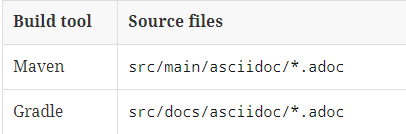

### Spring Rest Docs

---

- 필요성
  - 프론트 개발자와 백엔드 개발자와의 소통을 하기 위해서는 ***API 스펙이 정의된 문서가 필요***하다.
  - 하지만 문서를 수동으로 제작할 경우 고려해할 것이 많아진다.
    - ***문서 작성을 위한 form***
    - ***API가 수정되었을 경우 문서를 수정하지 않는 사람들***
  - Spring Rest Docs는 위와 같은 문제를 해결하기 위한 좋은 도구이다. 
<br/><br/>
- 장점
  - 테스트 코드만 적성하면 ***문서를 자동으로 만들어준다.***
  - ***프로덕션 코드에 추가적인 코드를 작성할 필요 없다.***
    - Swagger를 사용하면 Contrller 코드에서 가독성이 떨어지는 경우가 많다.
    - Sptring Rest Docs는 테스트 코드를 기반으로 문서가 만들어지기 때문에 프로덕션 코드의 가독성을 크게 신경 쓰지 않아도 된다.
  - 테스트 코드를 기반으로 문서 작성이 이루어짐으로 ***테스트를 실패하면 문서가 만들어지지 않는다.***
    - 만들어진 API 문서에서 요청과 응답 스펙이 누락될 일이 없다.
<br/><br/>
- 단점
  - Spring Rest Docs를 구성하는 과정이 그리 간단하지는 않다.
  - Spring Rest Docs를 작성하는 코드 또한 그리 간단하지 않다.
    - 특히 Controller Layer 테스트와 HTTP에 대한 이해도가 없으면...

### Spring Rest Docs 만들어지는 과정

---

1. RestDocs 기반 테스트 코드 작성 및 실행 시 스니펫 작성
   - 기본적으로 6개의 스니펫이 자동으로 작성된다.
   > - ${snippetsDir}/*/curl-request.adoc
   > - ${snippetsDir}/*/http-request.adoc
   > - ${snippetsDir}/*/http-response.adoc
   > - ${snippetsDir}/*/httpie-request.adoc
   > - ${snippetsDir}/*/request-body.adoc
   > - ${snippetsDir}/*/index/response-body.adoc
2. 생성된 스니펫을 사용하여 .adoc 파일 기반의 API 스펙 문서 생성
   
3. 빌드 이후 HTML 파일 자동 생성   
4. 생성된 파일을 이용해 서버에 API 스펙 문서를 서비스 가능하도록 배포

### build.gradle

---

```groovy
plugins {
    id 'org.springframework.boot' version '2.7.3'
    id 'io.spring.dependency-management' version '1.0.13.RELEASE'
    //gradle 7 부터는 'org.asciidoctor.convert'이 아닌 org.asciidoctor.jvm.convert 사용
    id "org.asciidoctor.jvm.convert" version "3.3.2" 
    id 'java'
}

group = 'com.example'
version = '0.0.1-SNAPSHOT'
sourceCompatibility = '8'

repositories {
    mavenCentral()
}
//2. snippets 생성 경로
ext {
    lombok_version = '1.18.24'
    snippetsDir = file('build/generated-snippets')
}

configurations {
    asciidoctorExt
}

dependencies {
    implementation 'org.springframework.boot:spring-boot-starter-web'
    developmentOnly 'org.springframework.boot:spring-boot-devtools'
    testImplementation 'org.springframework.boot:spring-boot-starter-test'

    //3. mockmvc를 통해서 rest-docs 작성하기 위한 라이브러리
    testImplementation 'org.springframework.restdocs:spring-restdocs-mockmvc'

    compileOnly "org.projectlombok:lombok:$lombok_version"
    annotationProcessor "org.projectlombok:lombok:$lombok_version"
    testCompileOnly "org.projectlombok:lombok:$lombok_version"
    testAnnotationProcessor "org.projectlombok:lombok:$lombok_version"
}

// test -> asciidoctor -> bootJar

// 4. 스니펫(Snippet)저장경로(build/generated-snippets)에 JunitTest 처리를 실행
test {
    outputs.dir snippetsDir
    useJUnitPlatform()
}

// 5. asciidoctor 시작할 때, static/docs 폴더 비우기
// 가끔 문서가 수정이 안되는 경우가 발생하기 때문에 선언
asciidoctor.doFirst {
    delete file('src/main/resources/static/docs')
}

//6. 처리된 결과를 Asciidoctor형식으로 2번에 지정해 준 스니펫(Snippet)경로에 인입
asciidoctor {
    inputs.dir snippetsDir
    dependsOn test
}

// 7. build task 시 build/docs/asciidoc 파일을 src/main/resources/static/docs로 복사
task copyDocument(type: Copy) {
    dependsOn asciidoctor
    from file("build/docs/asciidoc")
    into file("src/main/resources/static/docs")
}

//8. build 시 7번 작업 진행
build {
    dependsOn copyDocument
}

//9. bootJar task 시,  build/docs/asciidoc 파일을 BOOT-INF/classes/static/docs로 복사
bootJar {
    dependsOn asciidoctor
    copy {
        from "${asciidoctor.outputDir}"
        into 'BOOT-INF/classes/static/docs'
    }

}
```

### Spring Rest Docs 맛보기

---

1. 컨트롤러 작성
    ```java
    @RestController
    public class HelloController {
        @GetMapping("hello-world")
        public Map<String, Object> helloWorld(){
    
            Map<String,Object> helloWorldData = new HashMap<>();
            helloWorldData.put("data", "hello-world");
            return helloWorldData;
        }
    }
    ```
2. 스니펫 생성을 위한 테스트 코드 작성
    ```java
    @ExtendWith({RestDocumentationExtension.class, SpringExtension.class})
    @WebMvcTest(HelloController.class)
    @AutoConfigureRestDocs(uriScheme = "https", uriHost = "docs.api.com")
    public class HelloDocumentTest {
    
        @Autowired
        private MockMvc mockMvc;
    
        @Test
        public void helloWorldTest() throws Exception {
            this.mockMvc.perform(RestDocumentationRequestBuilders.get("/hello-world")
                    .contentType(MediaType.APPLICATION_JSON)
            ).andDo(MockMvcRestDocumentation.document("hello-world", PayloadDocumentation.responseFields(
                    PayloadDocumentation.fieldWithPath("data").description("hello-world")
            )));
        }
    }
    ```
3. build/generated-snippets/hello-world 폴더에 스니펫 생성 확인
4. src/docs/asciidoc 폴더에 hello-world.adoc 파일 생성 이후 API 스펙 정의
   - asciiidoc 문법이 따로 존재한다.
       ```asciidoc
       :doctype: book
       :icons: font
       :source-highlighter: highlightjs
       :toc: left
       :toclevels: 4
       :sectlinks:
       ifndef::snippets[]
       :snippets: ./build/generated-snippets
       endif::[]
    
       = hello world
    
       === request
       include::{snippets}/hello-world/http-request.adoc[]
    
       === response
       include::{snippets}/hello-world/http-response.adoc[]
       ```
5. build 이후 static/docs/hello-world.html 파일 생성 확인 및 실행하여 서비스 가능 여부 확인

### document 결과물 util 클래스 제작

---

```java
public class ApiDocumentUtils {

    public static RestDocumentationResultHandler document(Snippet... snippets){

        return MockMvcRestDocumentation.document("{class-name}/{method-name}",
                getDocumentRequest(),
                getDocumentResponse(),
                snippets
        );
    }

    private static OperationRequestPreprocessor getDocumentRequest(){
        return preprocessRequest(
                modifyUris()
                        .scheme("https")
                        .host("docs.api.com")
                        .removePort(),
                prettyPrint()
        );
    }

    private static OperationResponsePreprocessor getDocumentResponse(){
        return preprocessResponse(
                prettyPrint()
        );
    }
```
1. 스니펫 생성시 경로를 `{class-name}/{method-name}` 으로 자동 지정
2. 요청 및 응답 클래스 json 결과물 이쁘게 작성하기
3. 요청 도메인을 localhost에서 `https://docs.api.com `으로 표기하기
<br/>
- 코드 확인
    ```java
    @Test
    public void helloWorld() throws Exception {
        this.mockMvc.perform(RestDocumentationRequestBuilders.get("/hello-world")
                .contentType(MediaType.APPLICATION_JSON)
        ).andDo(ApiDocumentUtils.document(PayloadDocumentation.responseFields(
                PayloadDocumentation.fieldWithPath("data").description("hello-world")
        )));
    }
    ```

### 자동 생성되는 스니펫 사용자 정의

---

- 자동 생성되는 스니펫 파일와 같은 이름을 가진 파일을 src/test/resources/org/springframework/restdocs/templates 폴더안에 생성
  - /build/generated-snippets/\*/request-fields.adoc -> src/test/resources/org/springframework/restdocs/templates/request-fields.adoc
  - mustache 문법을 사용하여 작성
    ```text
    |===
    |필드명|타입|필수값|설명
    
    {{#fields}}
    
    |{{#tableCellContent}}`+{{path}}+`{{/tableCellContent}}
    |{{#tableCellContent}}`+{{type}}+`{{/tableCellContent}}
    |{{#tableCellContent}}{{^optional}}true{{/optional}}{{/tableCellContent}}
    |{{#tableCellContent}}{{description}}{{/tableCellContent}}
    
    {{/fields}}
    
    |===    
    ```
- 이후 테스트 코드를 돌려 /build/generated-snippets/\*/request-fields.adoc 파일 확인

### REST API 공통 응답 내용만 스니펫으로 작성

---

- 일반적으로 사내에서는 규격화된 API를 사용하는 경우가 많기 때문에 공통 응답 전용 API 스펙 문서가 필요한 경우가 발생할 수 있다.

#### 1. 공통 응답 클래스 제작

```java
@Getter
public class CustomResponse<T> {
    private int status;
    private T data;
    private String message;

    public static <T> CustomResponse<T> success(T data){
        CustomResponse<T> response = new CustomResponse<>();
        response.status = HttpStatus.OK.value();
        response.data = data;
        response.message = "성공입니다.";
        return response;
    }
}
```
<br/>

####  2. AbstractFieldsSnippet를 이용한 사용자 정의 스니펫 생성

- MockMvcRestDocumentation 클래스를 사용해 응답 스니펫을 생성하면, response-fields.snippet 만 조작이 가능
- 때문에 사용자가 보여주고자 하는 응답 포맷에 맞게 스니펫을 자동 생성 하기 위해 AbstractFieldsSnippet 상속 받아서 제작
    ```java
    public static class CommonResponseFieldsSnippet extends AbstractFieldsSnippet{
    
        protected CommonResponseFieldsSnippet(String type, List<FieldDescriptor> descriptors, Map<String, Object> attributes, boolean ignoreUndocumentedFields, PayloadSubsectionExtractor<?> subsectionExtractor) {
            super(type, descriptors, attributes, ignoreUndocumentedFields, subsectionExtractor);
        }
    
        @Override
        protected MediaType getContentType(Operation operation) {
            return operation.getResponse().getHeaders().getContentType();
        }
    
        @Override
        protected byte[] getContent(Operation operation) throws IOException {
            return operation.getResponse().getContent();
        }
    }
    ```
<br/>

#### 3. 공통 응답을 위한 컨트롤러 제작

```java
@RestController
public class CommonDocumentController {

    @GetMapping("/docs/response")
    public CustomResponse<Object> customResponse() {
        return CustomResponse.success(null);
    }
}
```
<br/>

#### 4. 공통 응답 규격 사용자 정의

- src/test/resources/org/springframework/restdocs/templates 폴더 안에 common-response-fields.snippet 파일 생성
    ```text
    ===== 공통응답
    |===
    |필드명|설명
    
    {{#fields}}
    
    |{{#tableCellContent}}`+{{path}}+`{{/tableCellContent}}
    |{{#tableCellContent}}{{description}}{{/tableCellContent}}
    
    {{/fields}}
    
    |===
    ```
<br/>

#### 5. 공통 응답 스니펫 생성을 위한 테스트 클래스

```java
@Test
public void commonResponse() throws Exception {

    Map<String, Object> attributes = new HashMap<>();
    attributes.put("title", "공통응답");


    mockMvc.perform(MockMvcRequestBuilders.get("/docs/response")
                    .contentType(MediaType.APPLICATION_JSON)
            )
            .andExpect(status().isOk())
            .andDo(document("common/response")
                    .document(commonResponseFields("common-response",
                            null, attributes,
                            fieldWithPath("status").description("응답 코드"),
                            fieldWithPath("data").description("데이터"),
                            fieldWithPath("message").description("응답 메시지")
                            ))
                    );
}


public static CommonResponseFieldsSnippet commonResponseFields(String type,
                                                               PayloadSubsectionExtractor<?> subsectionExtractor,
                                                               Map<String,Object> attributes,
                                                               FieldDescriptor... descriptors){
    return new CommonResponseFieldsSnippet(type, Arrays.asList(descriptors), attributes, true, subsectionExtractor);
}
```
- common-response-fields.snippet 파일을 읽어 들여 스니펫을 생성하기 위한 테스트 코드이다.
- 실행 이후 ./build/generated-snippets/common/response/common-response-fields.adocs 파일 생성 확인


  

> **Reference**
> - [Spring Rest Docs 공식 레퍼런스](https://docs.spring.io/spring-restdocs/docs/current/reference/html5/#getting-started)  
> - [우아한 형제들 Spring Rest Docs 적용](https://techblog.woowahan.com/2597/)   
> - [Spring REST Docs 적용 및 최적화 하기](https://backtony.github.io/spring/2021-10-15-spring-test-3/)
> - [Spring rest docs 적용기(gradle 7.0.2)](https://velog.io/@max9106/Spring-Spring-rest-docs%EB%A5%BC-%EC%9D%B4%EC%9A%A9%ED%95%9C-%EB%AC%B8%EC%84%9C%ED%99%94)
> - [Spring REST Docs에 DTO의 Validation 정보 담기](https://velog.io/@dae-hwa/REST-Docs%EC%97%90-DTO%EC%9D%98-Validation-%EC%A0%95%EB%B3%B4-%EB%8B%B4%EA%B8%B0)
> - [AsciiiDoc 문법](https://docs.netapp.com/ko-kr/contribute/asciidoc_syntax.html)