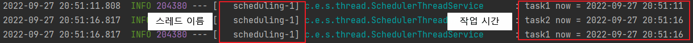

### Spring Scheduler

---
- 개발자가 ***일정 시간 간격으로 로직을 실행***시키고자 할 때 사용한다.
- Spring Boot Starter에 기본적으로 의존하고, 매우 간단하게 Scheduler를 만들 수 있으며 사용하는 방법도 간단하다.

### Spring Scheduler 사용법

---
- 스프링 실행 클래스에 `@EnableScheduling` 추가
  ```java
  @EnableScheduling
  @SpringBootApplication
  public class SpringSchedulerApplication {

      public static void main(String[] args) {
          SpringApplication.run(SpringSchedulerApplication.cla  ss, args);
      }
  }
  ```
- Scheduler를 사용할 클래스에 `@Component` 어노테이션 추가 및 메서드에 `@Scheduled` 어노테이션 추가
  ```java
  @Component
  public class SchedulerService {
      @Scheduled(fixedRate = 1000)
      public void ScheduledMethod(){
          //로직 ...
      }
  }
  ```
    - @Scheduled 규칙
      - 메서드는 void 타입
      - 메서드 매개변수 사용 불가

### @Scheduled 주요 필드

---

- fixedRate
    - 작성한 시간 간격으로 작업 시작
    - 이전 작업이 완료될 때까지 다음 작업이 진행되지 않음
- fixedDelay
	- 이전 작업이 종료된 후 설정시간 이후에 다시 시작
	- 이전 작업이 완료될 때까지 대기
- Cron
	- cron 표현식을 사용한 작업 예약

### Spring Scheduler Thread

---
- ***Scheduler는 기본적으로 Thread Pool 1개이며 동기 방식으로 작업***을 처리한다.
  - 즉, 하나의 어플리케이션에서 두개의 스케쥴된 작업이 있어도<br/> _**둘 중 하나의 작업이 완료되지 않으면 다른 스케쥴된 작업이 진행되지 않는다.**_
    ```java
    private String now(){
        return LocalDateTime.now().format(DateTimeFormatter.ofPattern("yyyy-MM-dd HH:mm:ss"));
    }

    @Scheduled(fixedRate = 1000)
    public void task1() throws InterruptedException {
        log.info("task1 now = {}", now());
        //task 1작업 5초동안 기다리기
        Thread.sleep(5000);
    }

    @Scheduled(fixedRate = 2000)
    public void task2(){
        String now = LocalDateTime.now().format(DateTimeFormatter.ofPattern("yyyy-MM-dd HH:mm:ss"));
        log.info("task2 now = {}", now);
    }
    ```
  - **실행 결과 <br/><br/>**
  
    - 위의 실행결과에서 보듯이 task2작업은 2초 후에 실행되어야 하지만 실행되지 않는다. 
  - 위 상황을 방지하기 위해서 Scheduler의 Thread Pool을 늘릴 필요가 있다.
      ```java
    @Configuration
    public class SchedulerConfig implements SchedulingConfigurer {
	
        private static final int POOL_SIZE = 10;
	
        private ThreadPoolTaskScheduler threadPoolTaskScheduler(){
            ThreadPoolTaskScheduler scheduler = new ThreadPoolTaskScheduler();
            scheduler.setPoolSize(POOL_SIZE);
            scheduler.setThreadNamePrefix("SCHEDULER-");
            scheduler.initialize();
            return scheduler;
        }
	
        @Override
        public void configureTasks(ScheduledTaskRegistrar taskRegistrar) {
            taskRegistrar.setTaskScheduler(threadPoolTaskScheduler());
        }
	
    }
    ```

### Spring Scheduler Async

---

- 위에서 설명했듯이 스케쥴러는 동기방식으로 진행된다. 이로 인해 _**이전 스케쥴된 작업이 끝나지 않으면 시간이 되어도 작업을 진행할 수 없다.**_
- 이를 위해서 비동기 방식으로 작업을 진행시켜주어야 한다.
  1. 스프링 실행 클래스에 `@EnableAsync` 어노테이션 선언
  ```java
  @EnableAsync
  @EnableScheduling
  @SpringBootApplication
  public class SpringSchedulerApplication {
  
      public static void main(String[] args) {
          SpringApplication.run(SpringSchedulerApplication.class, args);
      }
  
  }
  ```
  2. 스케쥴된 작업에 `@Async` 어노테이션 선언
  ```java
    @Async
    @Scheduled(fixedRate = 1000)
    public void task1() throws InterruptedException {
        log.info("task1 now = {}", now());
        //task 1작업 5초동안 기다리기
        Thread.sleep(5000);
    }
  ```
  3. Async와 Scheduler를 사용하기 위한 설정
  ```java
  @Configuration
  public class SchedulerConfig implements SchedulingConfigurer, AsyncConfigurer {
    
      private ThreadPoolTaskScheduler threadPoolTaskScheduler(){
          //...
      }
  
      @Override
      public Executor getAsyncExecutor() {
          return this.threadPoolTaskScheduler();
      }
  
      @Override
      public void configureTasks(ScheduledTaskRegistrar taskRegistrar) {
          //...
      }
  }
  ```

<br/>

> **Reference**
> - [@Scheduled를 활용한 Spring Scheduler](https://velog.io/@kimh4nkyul/Scheduled%EB%A5%BC-%ED%99%9C%EC%9A%A9%ED%95%9C-Spring-Scheduler)
> - [Spring Scheduler](https://data-make.tistory.com/699)
> - [크론(cron) 표현식 정리](https://zamezzz.tistory.com/197)