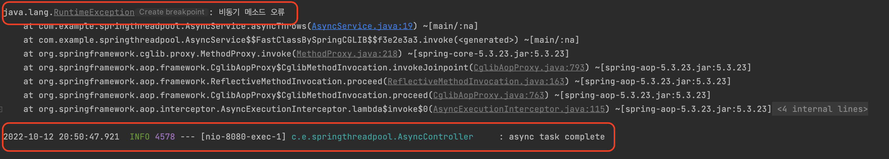
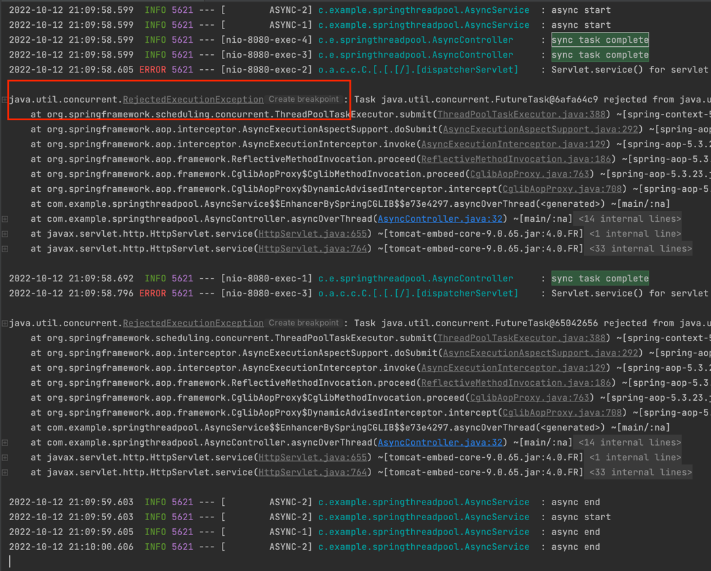
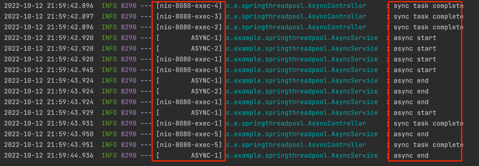

### 스프링 부트의 다중 요청 처리
---

- 스프링 부트는 하나의 프로세스에서 돌아가는 멀티 스레드 구조를 가지고 있다.
- 멀티 스레드 구조이기 때문에 사용자 한명의 요청이 아닌 여러 사용자의 요청을 처리할 수 있다.
- 실제로는 스프링 부트가 다중요청을 처리하는 것이 아닌, 스프링 부트에 내장되어있는 서블릿 컨테이너(tomcat)에서 다중 요청 처리해준다.
- 다중 요청 처리를 위해서 멀티 스레드 구조로 되어 있기 때문에 어떻게 스레드를 관리하는 알 필요성이 있다.


### 스레드 풀
---

- Thread Pool은 프로그램이 실행할 때 필요한 Thread를 미리 생성해 놓고 관리한다.
- 만약 Thread를 미리 생성하지 않으며 관리하지 않고 요청이 들어올 때 마다 하나씩 생성하면 어떤 문제가 있을까?
    1. 스레드 생성 비용이 생각보다 높기 때문에 많은 부담을 준다.
    2. 일단 요청이 들어온 순간부터 스레드를 무조건 생성을 해야하기 때문에 많은 동시 요청의 경우 스레드 생성의 억제가 어려워 서버가 다운될 확률이 눞다.
        - 실제로 Tomcat 3.2 이전 버전에는 유저의 요청마다 Thread를 생성하였다.

#### 스레드 풀 구조


#### 스레드 풀에서의 작업 처리 과정
1. 첫 요청이 들어올 경우 core-size 만큼 스레드가 생성된다.
2. 유저 요청이 들어올 때마다 작업 큐에 담아둔다.
3. core-size의 스레드 중, 유휴상태(idle) 상태인 스레드가 있다면 작업 큐에서 작업을 꺼내 스레드에 작업을 할당하여 처리한다.
    > 1. 만약 유휴상태인 스레드가 없다면, 작업은 작업 큐에서 대기한다.
    > 2. 그 상태가 지속되어 작업 큐가 꽉 찬다면, 스레드를 새로 생성한다.
    > 3. 위 과정을 반복하다가 스레드 최대 사이즈에 도달하고 작업큐도 꽉 차게되면, 추가 요청에 대해서는 connection-refused 오류를 반환한다.
4. 작업이 완료되면 스레드는 다시 유휴 상태로 된다.
    1. 작업큐가 비어있고 core-size이상의 스레드가 생성되었다면 스레드를 제거한다.

> 스레드가 너무 많으면 너무 많은 스레드가 cpu의 자원을 두고 경합하게 되므로 처리속도가 느려질 수 있기 때문에 적절한 수로 유지되는 것이 가장 좋다. <br/>
> 키워드 : `스레드풀 전략`,`적정 스레드 개수`

#### tomcat 스레드 풀 관련 Property

```groovy
# application.yml
server:
  tomcat:
    threads:
      max: 200          ## 생성할 수 있는 최대 스레드 수
      min-spare: 10     ## 최소 유지되어야하는 스레드 수
    accept-count: 100   ## 작업 큐 사이즈
    max-connections: 8192     ## 수립가능한 connection의 총 개수
    accept-count: 100         ## 작업큐의 사이즈
    connection-timeout: 20000 ## timeout 판단 기준 시간, 20초    
```


### tomcat 스레드 풀 테스트
---

- 스레드 개수와 작업 큐의 개수를 최소한으로 잡아서 실제로 유저요청이 거절되는지 확인해보자.

#### application.yml에서 tomcat 스레드풀 설정

```groovy
server:
  tomcat:
    threads:
      max: 2
      min-spare: 1
    accept-count: 1
``` 
- 최소 2개의 스레드가 생성가능하며, 1개의 요청은 작업 큐에서 대기한다.
- 총 3개의 요청 처리가 가능하다.

#### 3초간 대기 이후 응답
```java
@RestController
@Slf4j
public class HelloController {

    @GetMapping
    public String hello() throws InterruptedException {
        log.info("start");
        Thread.sleep(3000);
        log.info("end");
        return "hello world";
    }
}
```

#### 테스트 코드를 활용한 요청
```java
@Slf4j
public class SpringThreadPoolTest {

    @Test
    public void tomcatThreadTest() throws InterruptedException {


        RestTemplate restTemplate = new RestTemplate();
        for (int i = 0; i < 5; i++) {
            Thread thread = new Thread(() -> {

                String url = "http://localhost:8080";
                ResponseEntity<String> response = restTemplate.getForEntity(url, String.class);
            });
            thread.start();
        }

        Thread.sleep(10000);
    }
}
```
- 최대 2개의 스레드와 1개의 작업큐에서 작업을 대기시킬 수 있으니 총 3개의 요청 처리는 가능하지만 나머지 요청은 거절되어야 한다.

#### 테스트 결과


- 결과를 확인하면 모든 요청을 거절하지 않고 모두 처리되었다.
    -  물론 가끔씩 클라이언트 쪽에서 요청 에러가 발생하기도 한다.
        > `org.springframework.web.client.ResourceAccessException: I/O error on GET request for "http://localhost:8080": Error writing to server; nested exception is java.io.IOException: Error writing to server` 
    - 하지만 무조건 스레드 최대 개수 + 작업 대기 개수를 초과한다고 해서 클라이언트의 요청을 거절하지 않는다.
    어떻게 된 것일까?

### BIO Connector와 NIO Connector
---

- 현재까지 가정한 이야기는 BIO (Blocking I/O) Connector일 때 유효한 이야기다.
- 톰캣 8.0부터 NIO(NonBlocking I/O) Connector이 기본적으로 채택되어 있다.
- 톰캣 9.0부터는 BIO Connector는 deprecate 되었다.

### Connector

### BIO Connector

### NIO Connector

### Spring에서 비동기 처리를 하는 이유
--- 

- 클라이언트 요청 이후 비지니스 로직을 수행하던 도중 특정 로직의 경우, 끝날때 까지 기다려 주는 동기 처리 방식이 아닌 비동기 처리 방식으로 진행해야할 일이 가끔 발생한다.
    - 특정 로직의 시간이 너무 오래 걸리는 경우
    - 비지니스 로직과는 관련은 없지만 수행해야하는 경우
    - 비지니스 로직과는 관련 있지만 비동기 처리를 하더라도 클라이언트에게 지장이 없는 경우
    - 특정 로직이 실패 하더라도 비지니스 로직을 계속해서 수행해야하는 경우
        - try-catch로 잡는 방법도 존재
    - 등등..
- 위의 경우를 대비하여 스프링은 비동기 처리를 위한 방법을 제공한다.
> 키워드 : `ThreadPoolTaskExecutor`, `@Aysnc`, `@EnableAsync`

### ThreadPoolTaskExecutor
---

- ThreadPoolTaskExecutor 클래스는 쓰레드풀을 이용하여 멀티 스레드를 쉽게 구현해주는 스프링에서 지원하는 클래스이다.
- @Aysnc, @EnableAsync을 사용하면 간단하게 비동기 프로그래밍을 할 수 있다.
- 기본적으로 Spring에서 ThreadPoolTaskExecutor를 Bean으로 만들어주기 때문에 사용자가 직접 Bean으로 만들어도 되고 이미 만들어진 것을 사용해도 된다.

### ThreadPoolTaskExecutor 예제
---

#### 1. 메소드 비동기로 호출하기 위한 @Async 선언
```java
@Slf4j
public class DefaultAsyncService {
    @Async
    public void defaultAsync() throws InterruptedException {
        log.info("default async task start");
        Thread.sleep(1000);
        log.info("default async task end");
    }
}
```
- 1초 이후에 작업이 완료된다.

#### 2. 비동기 설정을 위한 @EnableAsync 선언
```java
@Slf4j
@Configuration
@EnableAsync
public class DefaultAsyncConfig {

    @Bean
    public DefaultAsyncService defaultAsyncService(){
        return new DefaultAsyncService();
    }
}
```

#### 3. Controller 만들기
```java
@RestController
@RequiredArgsConstructor
@Slf4j
public class DefaultAsyncController {

    private final DefaultAsyncService defaultAsyncService;

    @GetMapping("/default-async")
    public String defaultAsync() throws InterruptedException {
        defaultAsyncService.defaultAsync();
        log.info("default async task complete");
        return "hello world";
    }
}
```

#### 4. /default-async 호출하기
```java
    @Test
    public void defaultAsyncRequestTest() throws InterruptedException {
        RestTemplate restTemplate = new RestTemplate();
        String url = "http://localhost:8080/default-async";
        ResponseEntity<String> response = restTemplate.getForEntity(url, String.class);
    }
```
- 해당 엔드포인트 호출 시 `default async task complete` -> `default async task end` 일 것으로 기대한다.

#### 결과

- 기대하던 대로 결과물이 나왔다.

### ThreadPoolTaskExecutor 주요 속성
---

- 위에서 스레드풀에 대한 설명을 했기때문에 주요 속성에 대해서만 간단하게 알아보겠다.

|속성|내용|기본값|
|---|---|---|
coreSize|쓰레드 풀의 최소 사이즈|8|
maxSize|쓰레드 풀의 최대 사이즈, 작업 대기 큐의 사이즈가 가득 찬다면 새로운 스레드가 생상되고 maxSize를 초과하여 생성하지 않는다.|Integer.MAX_VALUE|
queueCapacity|작업 대기 큐의 사이즈, coreSize 개수를 넘어서는 task가 들어왔을 때 queue에 task들이 대기한다.|Integer.MAX|
allowCoreThreadTimeout|keepAlive 시간만큼 coreThread가 일을하고 있지 않는다면 coreThread도 제거를 한다.|false|
keepAlive|coreSize보다 많은 스레드가 생성되었다면 초과된 스레드들은 keppAlive 시간보다 하는 일이 없다면 제거된다.|60s|
<br/>

#### default ThreadPoolTaskExecutor .yml파일에서 셋팅
```groovy
spring:
  task:
    execution:
      pool:
        core-size: 1
        max-size: 2
        queue-capacity: 1
        allow-core-thread-timeout: false
        keep-alive: 60s
```

### ThreadPoolTaskExecutor 직접 생성하기
---

- 직접 ThreadPoolTaskExecutor를 생성하는 것도 가능하다.

#### 1. @Async 메소드 선언하기
```java
@Slf4j
public class AsyncService {

    @Async
    public void async() throws InterruptedException {
        log.info("async start");
        Thread.sleep(1000);
        log.info("async end");
    }
}
```

#### 2. 비동기 설정하기
```java
@Slf4j
@Configuration
@EnableAsync
public class AsyncConfig {

    @Bean("asyncThreadPoolTaskExecutor")
    public Executor asyncThreadPoolTaskExecutor(){
        ThreadPoolTaskExecutor executor = new ThreadPoolTaskExecutor();
        executor.setCorePoolSize(1);
        executor.setMaxPoolSize(2);
        executor.setQueueCapacity(1);
        executor.setThreadNamePrefix("ASYNC-");
        executor.initialize();
        return executor;
    }

    @Bean
    public AsyncService asyncService(){
        return new AsyncService();
    }

}
```

### Async 메소드 내에서 에러가 발생한 경우
---
- 비동기 메소드 내에서 에러가 발생해도 요청했던 비지니스 로직이 정상 동작하는지 확인해보자.

#### 1. 비동기 메소드 만들기

```java
    @Async
    public void asyncThrows() {
        log.info("async start");
        throw new RuntimeException("비동기 메소드 오류");
    }
```
- 비동기 메소드에서 RuntimeException 에러를 발생 시킨다.

#### 2. 동기적으로 로직을 수행할 컨트롤러 제작
```java
    @GetMapping("/async-throws")
    public String asyncThrows() throws InterruptedException {
        asyncService.asyncThrows();
        Thread.sleep(1000);
        log.info("async task complete");
        return "hello world";
    }
```
- 비지니스 로직이 1초정도 수행될것이라 생각하고 비동기 메소드에서 에러가 발생하더라도 `async task complete` 메시지가 정상적으로 출력되어야 한다.

#### 3. 결과



- 비동기 메소드 에러가 발생하여도 `async task complete` 메시지가 정상적으로 출력된것을 확인할 수 있다.

### 최대 스레드 초과와 작업 대기 큐를 초과한 경우
---

- 톰캣에 대한 요청 시, `최대 스레드 + 작업 대기 큐의 수`를 초과하여도 어느정도 요청이 가능했다.
- 그렇다면 ThreadPoolTaskExecutor의 스레드 풀은 `최대 스레드 + 작업 대기 큐의 수`를 초과하여도 비동기 로직이 정상 작동을 할까?

#### 1. ThreadPoolTaskExecutor Bean으로 등록

```java
    @Bean("asyncThreadPoolTaskExecutor")
    public Executor asyncThreadPoolTaskExecutor(){
        ThreadPoolTaskExecutor executor = new ThreadPoolTaskExecutor();
        executor.setCorePoolSize(1);
        executor.setMaxPoolSize(2);
        executor.setQueueCapacity(1);
        executor.setThreadNamePrefix("ASYNC-");
        executor.initialize();
        return executor;
    }
```
- coreSize는 1이고 MaxSize는 2이니 최대 2개의 스레드를 생성할 수 있다.
- queueCapacity는 1로 설정해 두었으니 스레드 2개가 작업을 진행하는 동안 1개가 기다릴 수 있다.
- 해당 스레드 풀은 총 3개의 작업의 요청을 받아 들일 수 있다.

#### 2. 비동기 메소드 제작
```java
    @Async
    public void asyncOverThread() throws InterruptedException {
        log.info("async start");
        Thread.sleep(1000);
        log.info("async end");

    }
```

- 비동기 메소드는 1초간 작업을 진행한다.
- 3초안에 3개를 초과한 작업이 들어오면 어떤 현상이 발생하는지 확인해보자.

#### 3. Contrller 제작

```java
    @GetMapping("/async-over-thread")
    public String asyncOverThread() throws InterruptedException {
        asyncService.asyncOverThread();
        log.info("sync task complete");
        return "hello world";
    }
```

#### 4. RestTemplate을 활용한 5번 연속 요청

```java
    @Test
    public void asyncOverThreadTest() throws InterruptedException {
        RestTemplate restTemplate = new RestTemplate();
        for (int i = 0; i < 5; i++) {
            Thread thread = new Thread(() -> {

                String url = "http://localhost:8080/async-over-thread";
                ResponseEntity<String> response = restTemplate.getForEntity(url, String.class);
            });
            thread.start();
        }

        Thread.sleep(1000);

    }

```


#### 5. 결과



- 결과를 확인해보니 3개를 초과한 요청에 대해서는 `java.util.concurrent.RejectedExecutionException` 에러가 발생했다.
- 뿐만아니라 `sync task complete` 메시지가 2건은 출력되지 않았다.
    - 비동기 메소드를 사용했지만 실제 비지니스 로직에까지 영향을 끼치는 로직이 되고 말았다.

### RejectedExecutionHandler
---

- `RejectedExecutionHandler` 는 `ThreadPoolTaskExecutor` 에서 `최대 스레드 + 작업 대기 큐` 가 꽉 찾을 경우 어떻게 처리할지를 결정할 수 있다.
    - `ThreadPoolTaskExecutor.setRejectedExecutionHandler(RejectedExecutionHandler)`
- `RejectedExecutionHandler` 에 대한 기본 정책의 구현체가 `ThreadPoolExecutor` 에 존재한다.

##### ThreadPoolExecutor.AbortPolicy
- `maxSize + queueCapacity`를 초과하는 요청이 들어 올 경우 `java.util.concurrent.RejectedExecutionException`이 발생하며 요청을 무시한다.
- `ThreadPoolTaskExecutor`에서 `RejectedExecutionHandler`의 기본 정책이다.

##### ThreadPoolExecutor.DiscardPolicy
- `maxSize + queueCapacity`를 초과하는 요청이 들어온 경우 Exception을 발생시키지 않고 무시한다.
##### ThreadPoolExecutor.DiscardOldestPolicy
- 가장 오래된 요청은 삭제하고 다시 
##### ThreadPoolExecutor.CallerRunsPolicy
- 해당 스레드풀을을 사용하는 메소드를 호출한 스레드에서 작업을 직접 실행한다.
    - 만약 Tomcat 서버에서 호출했다면 처리되지 않은 작업은 Tomcat Threead가 처리한다. <br/><br/>
    
##### ThreadPoolExecutor.DiscardOldestPolicy
- 처리되지 않은 가장 오래된 요청을 종료한 다음 재시도 한다.


### @Async 작동원리
> @Async는 AOP를 기반으로 작동하며 해당 어노테이션을 찾아 비동기 처리를 지원해 준다.

1. 애플리케이션 시작 시 @Async 어노테이션을 찾아 AsyncAnnotationAdvisor.class를 생성한다.
2. AsyncAnnotationBeanPostProcessor.class에서 @Async AOP처리를 위한 

AsyncAnnotationAdvisor 클래스에서 

> **Reference**
> - [스프링부트는 어떻게 다중 유저 요청을 처리할까?](https://velog.io/@sihyung92/how-does-springboot-handle-multiple-requests)
> - [Spring Thread Pool](https://velog.io/@tritny6516/Spring-Thread-Pool)
> - [Core pool size vs maximum pool size in ThreadPoolExecutor](https://stackoverflow.com/questions/17659510/core-pool-size-vs-maximum-pool-size-in-threadpoolexecutor)
> - [Spring Reference > application-properties](https://docs.spring.io/spring-boot/docs/current/reference/html/application-properties.html)
> - [Spring Boot Embeded Tomcat 내장 톰캣 application.properties 설정](https://aljjabaegi.tistory.com/601)
> - [@Async에서 사용하는 ThreadPoolTaskExecutor 최적화하기](https://sabarada.tistory.com/215)
> - [ThreadPoolTaskExecutor의 RejectedExecutionHandler 설정](https://jessyt.tistory.com/171)
> - [결제 시스템 성능, 부하, 스트레스 테스트](https://techblog.woowahan.com/2572/)
> - [Spring Reference > Task Execution and Scheduling](https://docs.spring.io/spring-boot/docs/current/reference/html/features.html#features.task-execution-and-scheduling)