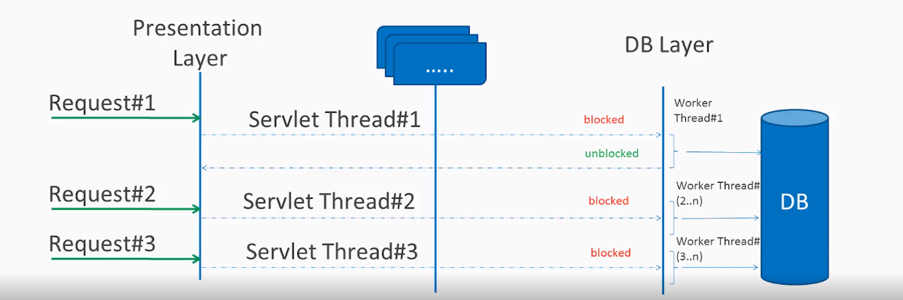
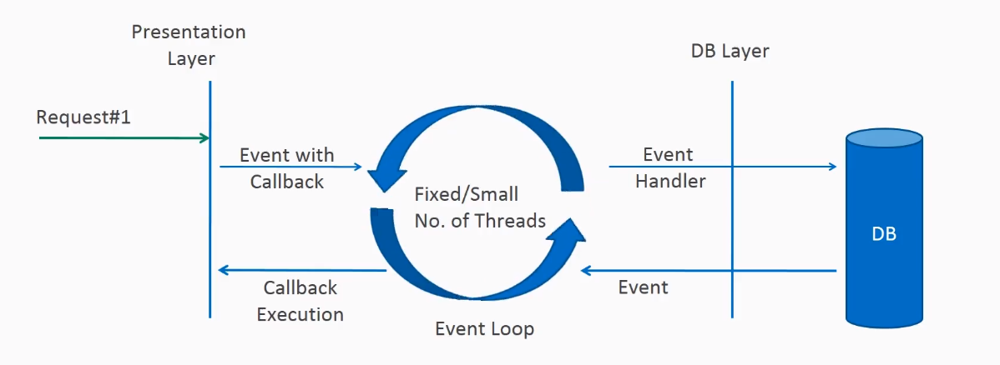
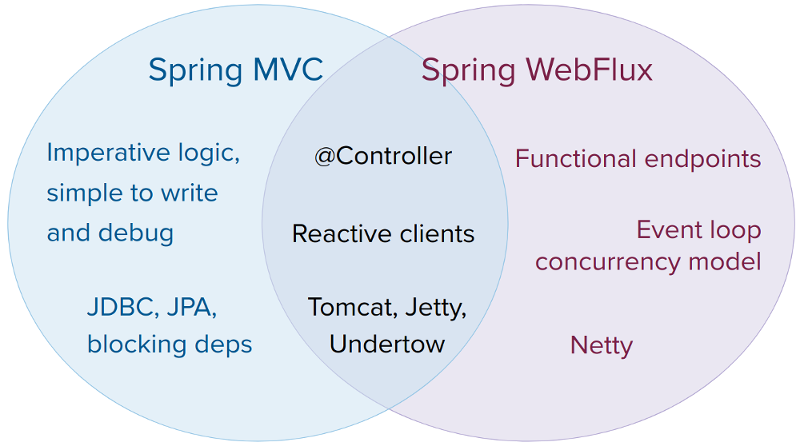

## 1. Spring WebFlux

- Spring WebFlux는 async, non-blocking I/O을 이용한 요청과 응답을 통해서 적은 하드웨어 리소스로 높은 처리량을 기대할 수 있는 어플리케이션이다.
  - async, non-blocking I/O로 구축된 서비(Netty)를 이용한다.
- aync, non-blocking 스트림 API(CompleteableFuture, ReactiveX)로 구성된 프로그래밍을 지원하며, 함수형(Funtional) 엔드포인트도 지원을 한다.
  - 기존 Spring MVC에서 사용하는 @Controller와 같은 어노테이션 기반의 엔드포인트도 지원한다.

## 2. Spring MVC vs Spring WebFlux 요청 처리 과정 

### 2.1. Spring MVC 요청 처리 과정

- Spring MVC는 클라이언트로부터 요청이 들어오면 Sevlet Thread를 생성하거나 Thread Pool에 존재하는 스레드를 이용하여 요청을 처리하게된다.
- Sevlet Thread가 요청을 처리하는 도중 중간에 네트워크 통신을 통해서 데이터를 쓰거나 읽어야하는 경우(DB, API) Worker Thread에게 요청을 위임하게 된다.
- 이때 Worker Thread가 작업을 완료하기 전까지, Servelt Thread는 대기상태가 된다. (Sync, Blocking)
- 기본적으로 서버는 하드웨어의 성능에 따라서 요청을 처리할 수 있는 최대 스레드 수를 가진다. 만약 스레드를 관리하지 않고 무한하게 요청을 받을 수 있다면 서버가 터질수도 있기 때문이다.
  
-  Servelt Thread의 대기로 인해서 클라이언트가 추가적인 요청을 할때 서버의 최대 스레드 수를 넘기는 요청을 하게 될 경우 서버는 요청을 거절하거나, 요청을 큐에 담아서 사용가능한 스레드가 존재할 때 처리를 해주게된다.

### 2.2. Spring WebFlux 요청 처리 과정  

- Spring WebFlux는 일반적으로 요청을 처리하는 단일 스레드만 존재한다.
- 클라이언트로부터 요청이 들어오게 되면 요청 스레드는 스레드풀에 요청을 위임하면서 Callback 정보를 전달한다. 요청 스레드는 다시 요청을 처리할 수 있는 상태가 된다. 
- EventHander가 작업을 완료하게되면 스레드 풀에서 하나의 스레드에게 응답을 할 수 있는 Callback을 전달하게되며 이후 클라이언트에게 응답을 한다.
- `클라이언트 <-> 애플리케이션, 애플리케이션 <-> 저장소`을 처리하는 과정 도중 대기상태에 빠지지 않으며 Callback을 통해서 응답을 하기 때문에 적은 스레드의 수로도 애플리케이션을 운영할 수 있는 장점이 있다.
- 스레드의 수가 적으면 낮은 하드웨어 리소스로도 큰 처리량을 기대할 수 있으며, 스레드간의 Context Switching이 줄어들게된다는 장점이 잇다.

> https://howtodoinjava.com/spring-webflux/spring-webflux-tutorial/

- Reactive는 이벤트에 따라서 반응하는 프로그래밍 모델을 말한다.
  - I/O 이벤트 (요청? 응답 이벤트?)
  - 마우스나 키보드와 같은 이벤트를 통해서 UI 컨트롤러의 변화
- syncronize 웹 서버의 경우에는 사용자의 요청으로 인해서 응답이 완료되기 까지 
- Reactive Stream은 구독자에게 얼마나 빠르게 또는 느리게 데이터를 생성하는지 제어하도록 하는 것이 목적이다.

> https://www.baeldung.com/spring-webflux

> Spring Webflux를 통해서 API를 제작할 때, 중간에 blocking될 수 있는 메소드를 사용하지 않는 것이 좋다. 그렇지 않으면 Spring Webflux를 사용하는 이점이 사라진다.

> Do Not Block!
We must make sure that we don’t use any blocking methods throughout the lifecycle of an API. Otherwise, we lose the main advantage of reactive programming!

### Spring MVC vs Spring WebFlux

- Spring MVC에서는 blocking 서버를 사용하기 때문에 사이즈가 큰 스레드풀을 생성하여 사용하기 때문에 많은 리소스가 필요하다.
- Spring WebFlux는 non-blokcing 서버를 사용하기 때문에 사이즈가 작은 스레드풀로도 많은 사용자의 요청을 처리할 수 있다.

### Reactive Programming

- 전통적인 스트림은 blocking, sequential, fifo(first-in-first-out) 구조를 가지고 있다.
- 

Reactive programming is a programming paradigm that helps to implement non-blocking, asynchronous, and event-driven or message-driven data processing.

### Functional Routing and Handling

- Spring Webflux는 함수를 이용하여 요청에 대한 응답을 핸들링할 수 있다.
- 기본적으로 Spring MVC에서는 @Controller라는 어노테이션 기반으로 제작을 한다.
- 

> https://reflectoring.io/getting-started-with-spring-webflux/
`RouterFunction`

> https://docs.spring.io/spring-framework/reference/web/webflux/new-framework.html